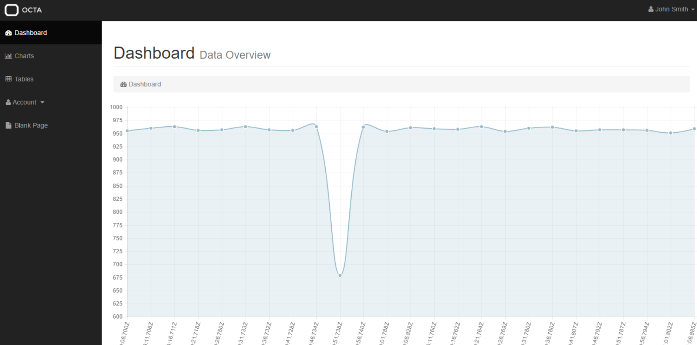
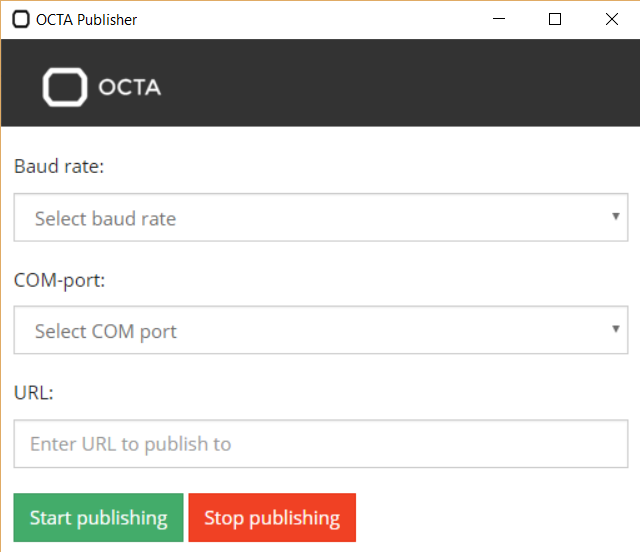
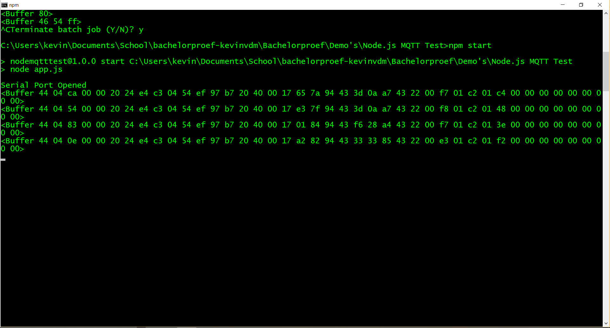
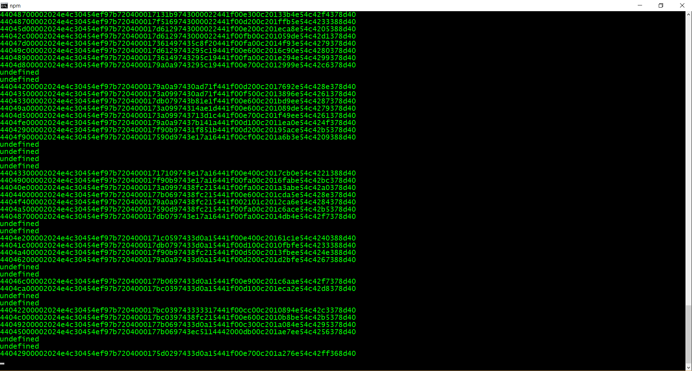

# Logboek **Kevin Van de Mieroop**

## Week 1 (15/2/16 - 21/2/16)

### Maandag

* Onthaal
* Begeleidend team vandaag niet aanwezig, voorlopige plek gekregen
* Logboek in orde beginnen maken
* Presentatie gekregen over eigen development board: Octa
* Onderzoek naar mogelijke usecases (smart home - smart meter - smart car)
* Onderzoek gedaan naar verschillende technologieen
* ANT+, Bluetooth Low Energy, Wi-Fi, 6LowPAN, Z-WAVE, DASH7, SigFox, LoRa, GPRS
  - ANT+: Gelijkaardig aan Bluetooth Low Energy; 2.4GHz, 50m, 1Mbit/s, weinig data; minder support dan BLE
  - BLE: 2.4GHz, 50m, 1Mbit/s, maximum 20b; voordeel: veel support, low energy
  - 6LowPAN: elke node krijgt IPv6 adres, via open standaarden communiceren
  - Z-WAVE: domotica, ~40-150m, two-way, reliable, duur
  - DASH7: belangrijkste protocol: BLAST principe: Blasty, Light, Asynchronous, Stealthy, Transitional; van enkele meters tot enkele kilometers
* Papers omtrent DASH7 gelezen om beter begrip te krijgen van waar ik mee zal werken
* Tutorials rond Octa Devkit SDK gelezen (Eclipse IDE)

### Dinsdag

* Postgraduaat team vandaag wel aanwezig vanaf 12u, concrete taak afgewacht
* Tijdens het wachten MQTT onderzocht
* Cheat sheet toegevoegd aan bachelorproef map, met uitleg over alle gebruikte protocollen
* Meeting gehad met postgraduaten van 13.00u tot 14.00u
* (Algemene) opdracht gekregen: backend en frontend ontwikkelen voor basisapplicatie van Octa
* Schema gemaakt van architectuur
* Vereiste literatuur opgezocht: Python, MQTT (!) tutorials, demo's te maken
* README gelezen over DASH7 backend

### Woensdag

* Eclipse geinstalleerd
* Geexperimenteerd met Mosquitto (MQTT Broker)
* Na enkele pogingen Mosquitto succesvol (binair) kunnen installeren door de juiste dll's in de folder te steken
* In command prompt netstat -an: Mosquitto loopt op poort 1883 en staat in de lijst; het is dus up and running
* Een node.js app aangemaakt; hierin een snippet gestoken die een publisher en subscriber in zelfde bestand implementeert
* Snippet gebruikt test broker (*test.mosquitto.org*); veranderd naar eigen broker (*mqtt://localhost:1883*)
* App.js werkte, "Hello MQTT" verscheen 

### Donderdag

* Node.js app verder uitgewerkt: aparte publisher (Client 1) en aparte subscriber (Client 2)
* Client 1 opgestart --> Client 2 opgestart --> message verscheen in console Client 2 [MQTT Publisher/Subscriber Node.js](http://i.imgur.com/U6anSqj.png)
* Geexperimenteerd met Qualities of Service (QoS):
     * QoS 0: "At most once"; bericht wordt eenmaal verstuurd vanaf publisher, subscriber kan het ontvangen
     * QoS 1: "At least once"; bericht wordt bijgehouden door de afzender totdat een acknowledgment is teruggekregen (PUBACK)
     * QoS 2: "Exactly once"; Publish --> PUBREC(eived) --> PUBREL(eased) --> PUBCOMP(leted)
* Onderzoek gedaan naar WebSockets --> constante verbinding tussen client en server
* Websockets module in npm voor gebruik in Node.js: websocket te implementeren voor gebruik in platform
   * Week 2 beginnen aan implementatie

## Week 2 (22/2/16 - 25/2/16)

### Maandag

* Beste opties beginnen verzamelen voor backend
* Vooral onderzoek gedaan naar welke database het beste is
* MongoDB gebruiken om data op te slaan --> data parsen bij opslag of bij ophaal data?
* Projecten opgezocht die zelfde modules gebruiken om inspiratie te krijgen
     * https://utbrudd.bouvet.no/2015/01/11/voice-controlling-a-robot-using-arduino-node-js-mqtt-websockets-johnny-five-and-html5-speech-recognition/ --> gebruikt Johnny Five module in npm (JavaScript robotics platform voor bv Arduino)
* Dinsdag Arduino meebrengen voor demo te maken!

### Dinsdag

* Arduino meegebracht
* Gelezen: https://www.compose.io/articles/building-mongodb-into-your-internet-of-things-a-tutorial/
* Korte meeting gehad, stand van zaken meegedeeld
   * Huidig plan: Arduino opstelling maken --> geeft sensordata door via seriele communicatie
   * --> Node vangt het op met npm module "serialport"
   * --> Node slaat (parsed) data op in MongoDB
   * --> Andere Node client haalt data op uit MongoDB
   * --> Geeft data door (express?) aan frontend (AngularJS)

### Woensdag

* Demo opstelling gemaakt van Arduino, LDR, Node.js (serialport) [Arduino opstelling](http://i.imgur.com/8GMeofV.png)
* Programma geschreven dat ledjes doet branden: veel licht = groen, minder licht = geel, geen licht = rood
* Node applicatie geschreven met serialport module die gegevens uitleest van COM-poort
   * Hier in problemen gekomen: las de gegevens niet juist uit
   * Deelse oplossing: parser gebruikt die bij library zit, delimiter toegevoegd aan println in Arduino code
   * Console printte maar 1 character uit (de eerste)
   * Samen met collega's lang gedebugd
* Node krijgt nu succesvol alle data door via serialport module
* Wordt weergegeven in console: [Console vensters MQTT](http://i.imgur.com/hyCMOM1.png)

### Donderdag

* Begonnen aan implementatie MQTT
* MQTT client (publisher) subscribed op topic "lightmeasuring"
   * Seriele connectie gaat open --> publisht geparsede data rechtstreeks op topic
* Andere MQTT client (andere Node.js app/subscriber) subscribed op topic "lightmeasuring"
   * Aangekregen data wordt in console succesvol weergegeven
* MongoDB geinstalleerd op laptop
* Begonnen aan implementatie MongoDB
   * Payload wordt automatisch doorgegeven aan MongoDB voor gebruik
   * Mogelijk via wildcard subscriber (subscriben op subtree van topics met # of 1 level topic met +)
* Implementatie MongoDB gelukt --> geeft datastream door aan test database
* Volgende week server maken die alle gegevens (inclusief historic data) ophaalt uit database om ze dan aan frontend te geven

## Week 3 (29/2/16 - 03/03/16)

### Maandag

* Nieuwe database aangemaakt specifiek voor project
* Data leek doorgegeven te worden (geen foutmelding) maar kreeg het niet in console
* Guides gevolgd ivm MongoDB
* Voorbeeldcodes opgezocht en geprobeerd

### Dinsdag

* MongoDB staat nog steeds niet op punt
* Tutorials opgezocht
* Voorlopig verdergaan met test database -> bestond niet meer
* MongoDB opnieuw geinstalleerd en met test verdergegaan
* Beginnen aan frontend om niet op schema achter te geraken
* Iets vroeger doorgegaan om "Smart Systems 5" te volgen (met toestemming)

### Woensdag

* AngularJS opfrissen
* Codecademy cursus ivm AngularJS gedaan: https://www.codecademy.com/learn/learn-angularjs
* Projecten herbekeken (bv Web Frameworks) om MEAN stack op te frissen
* Frontend beginnen maken voor demo-opstelling met test database
* Kreeg gegevens van publieke db op scherm via Angular
* Data uit eigen database komt niet tevoorschijn --> trial and error
* GitHub probleem met demo pushen proberen op te lossen: filename (path) too long

### Donderdag

* Om toekomstige problemen te vermijden simpele MEAN app beginnen maken
* Gebruik makend van MongoDB (Mongoose), ExpressJS, Node.js en AngularJS
* Users aanmaken (POST), wijzigen (PUT), ophalen (GET), en verwijderen (DELETE)
* Lokale MongoDB werkt nu perfect, migratie naar MQTT app proberen te verwezenlijken

## Week 4 (07/03/16 - 10/02/16)

### Maandag

* Migratie van code MEAN app naar MQTT app begonnen
* MongoDB opgestart: lightdb met collectie "lights" aangemaakt (lokaal)
* Andere MQTT broker opgesteld op server van Jens (HiveMQ)
* Nieuwe MQTT broker werkte maar zette ontvangen data nog niet in DB

### Dinsdag

* Verder gewerkt aan migratie MEAN naar MQTT app
* Volledige code overgezet (inclusief GET, POST, PUT en DELETE; zijn niet allemaal nodig)
       * Zo is het mogelijk om met Postman te kijken naar inhoud database
       * = gemakkelijker dan command line steeds te gebruiken
* Uiteindelijk gelukt zonder Mongoose (enkel mongodb package) te gebruiken
* Data vloeit binnen in database: [Inhoud database via Postman](http://i.imgur.com/oqwMJDY.png)
       * Elke data-element heeft een date and time
* Volgende punt is frontend (inloggen met id en historic data tonen in plot)
* Beginnen maken in AngularJS en bootstrap

### Woensdag

* Naar jobbeurs van AP/KDG gegaan in Antwerp Expo (11.00-14.00)
* In namiddag nog naar stageplek gegaan
* Controller gemaakt voor view
     * Structuur database niet optimaal voor Angular
     * Collection opnieuw aangemaakt met betere structuur
* Jens Gecko klaargemaakt met DASH7 om Arduino te vervangen

### Donderdag

* Verdergewerkt aan view en controller
* Controller geeft error als hij extern wordt gelinked; voorlopig controller script in view steken
* Structuur van database verder geoptimaliseerd voor ng-repeat (array in array)
* View geeft juiste gegevens weer (Lightvalue en exacte tijdstip)
* [Screenshot van view draft 1](http://i.imgur.com/qXDqG8S.png)
* [Structuur van database draft 1 (via Postman)](http://i.imgur.com/BBC8DD3.png)
* Volgende week: data automatisch updaten ($scope.$apply), dummy data (Arduino) vervangen met Gecko+Dash7
    * Eventueel: charts reeds verwerken in frontend

## Week 5 (14/03/16 - 17/03/16)

### Maandag

* Full stack applicatie herbekeken
* Code opgeschoond, comments beginnen bijzetten om verstaanbaarder te maken
    * "Unexpected token < op regel 1 van HTML" --> Serverside probleem met ExpressJS: geeft niet alle juiste maps mee
    * Relatieve links toegevoegd
    * Links naar externe files werken nu wel
* Research gedaan naar nieuwe AngularJS functies
    * $scope.apply, $scope.$watch enz

### Dinsdag

* Verder research gedaan naar AngularJS functies
* Hoe best responsief maken? Data automatisch laten updaten
* * Hoe data van controller naar andere controller overzetten?
    * Via overkoepelende services
    * Via broadcasting
* Volledige opgehaalde json data broadcasten naar andere controllers ($broadcast)
    * In andere controller $on
* In namiddag naar les Smart Systems 5 gegaan   

### Woensdag

* Broadcast testen met console logs
* Onderzoek naar charts gedaan
* Gebruik maken van bootstrap template met dashboard?
* Of: zelf maken en libraries gebruiken
* Laatste gekozen: research naar AngularJS charts: angular-chart.js
* Toegevoegd aan frontend

### Donderdag

* Geexperimenteerd met Chart.js
* Hardcoded elementen worden nu weergegeven in chart
* Neemt array aan voor labels (strings) en array voor data (int)
* Opgehaalde json data via $on moet gesplits worden
     * 1 array met waarden (value); parseInt() om strings naar int om te zetten
     * 1 array met timestamps (when)
* Correcte data wordt nu rechtstreeks opgehaald uit database en wordt gevisualiseerd in de chart
* Nu: automatisch updaten
     * met $timeout: wacht 1 seconde en doet opnieuw http request
     * probleem: alle data wordt steeds bij de array gepusht
     * oplossingen gezocht: maximum aantal objecten in array en laatste deleten
* if statement in for loop kijkt of lengte van array langer is dan 25
     * --> array.Shift() om eerste element eruit te gooien en nieuwe automatisch toevoegen
* Chart is responsief en updatet automatisch maar grafieklijn begint onderaan --> animatieprobleem (geen console error of bug) [Chart van light data)](http://i.imgur.com/zyvEGfT.png)
* Op punt zetten volgende week

## Week 6 (22/03/16 - 25/03/16)

Wissel: **dinsdag - vrijdag** ipv maandag - donderdag aangezien maandag niemand op bureau zit; vrijdag wel

### Dinsdag

  * Geexperimenteerd met Chart.js
  * Verschillende charts geprobeerd
    * Line charts, bar charts, pie Charts, donut charts,...
    * Line charts beste in elk geval van visualisatie van sensor data
  * Nog steeds probleem met animatie
    * Oorzaak: x-as refresht constant door timestamps die veranderen
    * Simpele oplossing: animatie afzetten in options van chart.js (in index.html)

               chart-options="{animation:false}"

### Woensdag

  * View is niet echt esthetisch
  * Naar bootstrap gezocht
  * Free dashboard bootstraps zijn er niet al te veel
  * Op startbootstrap.com: SB Admin
  * Meeste features gestript (berichtgeving/notificaties/forms allemaal niet nodig)
  * Titels van paginas veranderd
  * Chart erin verwerkt (gewoonweg html code gekopieerd naar template)
  

### Donderdag

  * Probleem: app begint langzamer te gaan naargelang database gevuld wordt
  * Oplossing: Niet gehele database doorgeven aan frontend of data entries beperken in database --> shiften zoals chart array?
  * Momenteel: database handmatig leegmaken als app langzamer gaat
  * Opgezocht hoe beperkte data doorgegeven kan worden
    * MongoDB find, sort & limit

                db.lights.find().sort({$natural:-1}).limit(100)
        >retourneert de laatste 100 entries; natural wijst op oorspronkelijke volgorde en -1 wijst op nieuw naar oud

    * Werkt nog steeds niet; voorlopig issue uitgesteld

### Vrijdag

  * Opgezocht hoe executable maken van Node.js applicaties
  * Zonder gui: gebruik maken van enclose module in npm
  * Maakt simpele .exe die node app opent in command line
  * Werkt met publisher; niet met subscriber (server)
  * Problemen met bepaalde modules
    (chart.js wordt niet weergegeven; algemeen dashboard wel)
  * Code opgeschoond, voor toekomstig gebruik is publisher executable nuttig

## Week 7 (12/04/16 - 15/04/16)

### Dinsdag

  * Meeting gehad na paasvakantie
    * Goed op weg; gateway software is belangrijkst
    * .exe is goed, maar GUI is nodig
    * GUI voor COM-poort in te geven, baud rate en URL waarnaar data gestuurd moet worden
    * Dashboard nuttig maar bestaande service is voldoende (verder uitwerken voor BAP)
    * Bv dashing; freeboard.io
  * Tussentijdse presentatie
    * live demo enkele keren getest
    * presentatie gegeven op einde van dag

### Woensdag

  * Examen Smart Systems 5 gehad
  * Verder gewerkt aan opdracht: dashboard services opgezocht
  * Freeboards.io: dashboard krijgt data binnen en geeft automatisch weer in charts
  * Dashing: gebruik van widgets die customized kunnen worden
    * In Ruby
  * Blynk: Mobile IoT dashboard
  * Gebruikelijkst = freeboard.io

### Donderdag

  * Publisher beginnen verwerken in executable
  * Ofwel: NW.js (Node-webkit), of Electron (populairder en dus meer support)
  * [NW.js](http://nwjs.io/): desktop applicaties met webtechnologieen schrijven
    * Gebruik van Node.js modules mogelijk
    * Cross-platform!
    * Makkelijk te packagen en distribueren
    * Nadeel: Uiteindelijke package = groot
  * [Electron](http://electron.atom.io/)
    * Zelfde voordelen; kleinere filesize
    * Applicaties op Electron: Slack, Postman, Stremio, Atom, VS Code, ...
  * Gekozen voor Electron

### Vrijdag

  * Onderzoek gedaan naar Electron
  * Tutorials gevolgd
    * http://electron.atom.io/docs/latest/tutorial/quick-start/
    * https://medium.com/developers-writing/building-a-desktop-application-with-electron-204203eeb658#.otwykqtex
  * Zelf beginnen ontwikkelen
    * Makkelijk mooi maken met bv bootstrap
    * Debuggen is moeilijker dan bij bv C# desktop apps (mbv console)
    * Basic layout: 

## Week 8 (19/04/16 - 22/04/16)

### Dinsdag

  * Electron app verder uitgewerkt
  * Probleem: serialport module werkt niet out-of-the-box met Electron
  * Belangrijker: definitieve gateway is af
    * Implementeren in publisher
  * Data komt via seriele poort binnen (elke 10sec)
  * Data moet nog geparsed worden
    * Probleem: bereik niet ideaal, pakketjes komen niet volledig binnen
    *    

    >Buffers komen binnen (ff d8 88 ff = "gateway" wanneer hij gereset wordt)

  * Morgen aan parser werken

### Woensdag

  * Binnenkomende data beginnen analyseren
  * Totaal van 23 bytes per pakket
  * Document gekregen om data te ontcijferen
    * Nog niet duidelijk
    * Parser gevraagd

### Donderdag

  * Bereik nog steeds niet ideaal
    * Beneden gaan zitten in de buurt van gateway
  * Bereik nu wel goed, krijg pakketjes binnen van 41 bytes (82 hex characters)
  * Parser gekregen om te ontcijferen
    * Is in Python, dus moet eerst Python zelf kunnen begrijpen

### Vrijdag

  * Parser in Python beginnen analyseren
  * Eerst basis syntax Python leren
  * Beslist om de verkregen parser enkel te analyseren en erna in JavaScript om te schrijven in applicatie (backend)
  * Parser ontleed string in verschillende delen
    * temperatuur, licht, rh (humidity), CO2, VOC (luchtvervuiling) en coordinaten

## Week 9 (26/04/16 - 29/04/16)

### Dinsdag

  * Jobbeurs Streekpersoneel in Kinepolis Antwerpen

### Woensdag

  * Parser verder ontleed
    * Verdeelt string onder per bytes, elke sensordata bevat respectievelijk:
        * 4, 4, 2, 2, 2 en 8 bytes (4 voor longitude en 4 voor latitude)
    * Hierna wordt de hex waarde omgezet naar decimale waarde
    * Gateway bakje nodig voor demo dus krijg morgen geen data binnen
        * Verder werken aan app

### Donderdag

  * Aan electron app verderwerken
    * Van scratch maken door fout met serialport
    * Deze keer basisstructuur gebruiken opgegeven door electron
        * node_modules (bevatten alle Node.js packages)
        * main.js (belangrijkste js bestand, gelijk aan de Node.js app)
        * index.html (de view, layout van de applicatie)
        * package.json (dependencies/versies van packages)
    * Basis main.js bestand gebruiken opgegeven door electron met weinig wijzigingen
    * Voorlopig niks aan layout doen, geen extra modules installeren
    * Vanaf dat serialport geinstalleerd wordt en geinitialiseerd: DLL initialization error

### Vrijdag

   * Error gegoogled: frequente fout op fora
   * Stelt voor van app opnieuw te builden
   * Enkele keren opnieuw geprobeerd, zelfde fout
   * Sommigen hebben aangepaste serialport module geschreven specifiek voor electron
     * Nieuwe fout: serialport.node not found
     * Wanneer gewone serialport module wordt geinstalleerd voor node bestand in app te steken, zelfde DLL fout
   * Halve dag afgesproken om aan ander project te werken

## Week 10 (03/05/16 - 06/05/16)

### Dinsdag

   * Verder gegaan met debuggen
   * Gelezen dat het te maken kan hebben met version mismatches
     * Verschillende versies tegen elkaar opgezet zonder succes
   * Dieper ingegaan op probleem
     * Serialport module is geschreven in pre-gyp, niet ondersteund door electron
   * Electron-rebuild module geinstalleerd: rebuild de applicatie tegen de juiste versies
     * Heeft ingebouwde --pre-gyp-fix optie voor mijn specifieke probleem
     * Na electron-rebuild te runnen, nog steeds hetzelfde probleem (DLL initialization error)
   * Les Smart Systems gevolgd

### Woensdag

   * Voorlopig opnieuw NW.js gebruiken, wordt door meeste fora aanbevolen voor serialport
   * basisstructuur nw.js downloaden
   * Executable runt reeds zonder problemen, maar zonder view (blank scherm)
   * Praktisch zelfde view gebruiken als eerste poging
     * Nieuw logo erin
   * Modules opnieuw downloaden
   * Applicatie runt zonder probleem

### Donderdag

   * Modules initialiseren in app
     * met lijn code "var sp = require ('serialport') geen crash met nw.js, wel met electron
     * Hardcoded werkt de applicatie
   * Begonnen met forms te schrijven
     * Werkt zoals gewone javascript
     * Opties zoals baud rate en com poort worden gesubmit via form naar applicatie
     * Form-input wordt geregistreerd en doorgegeven als functie init() wordt gerund
     * Hierna loopt de applicatie constant als publisher naar mqtt broker

### Vrijdag

   * Probleem: nw.js applicatie gepackaged is zeer groot (+ 100MB)
   * Opgezocht en dit probleem zou zich niet mogen voordoen bij electron
   * Voorlopig bij nw.js houden en zien dat volledige app werkt inclusief integratie met freeboard
   * Code opgeschoond, volgende week opnieuw aan parser werken

## Week 11 (10/05/16 - 13/05/16)

### Dinsdag

   * BPost bak (gateway) naar bureau boven gebracht
     * Geen problemen met bereik meer, enkel nog volledige pakketjes
   * Volledige string overgeschreven op papier, beginnen ontleden
     * Achteraan begonnen; coordinaten (4b + 4b, checksum (1b), VOC (2b), CO2 (2b), RH (2b), licht (4b) en temperatuur (4b)
   * Strings arriveren in buffers, zouden omgezet moeten worden naar 1 volledige samenhangende string (in hex)
   * Door te kijken hoe strings aankomen in database, gezien dat er geen enkele data wordt opgeslagen (met Postman)
   * Probleem met database oplossen
     * Backend krijgt ze wel aan via mqtt en schrijft geen error uit
     * Collecties van naam veranderd
     * Postman geeft nog steeds lege database weer

### Woensdag

   * Probleem met database verder oplossen
   * Opnieuw alle code gecontroleerd met verwijzingen naar database
   * Mongo loopt effectief, server is actief
     * Geen 404, enkel lege array die wordt teruggegeven
   * Drastische optie: code van oude werkende app gekopieerd naar huidige versie
     * Oude collectienamen
     * Succesvol, data van gisteren zelfs in database
     * Probleem zat dus waarschijnlijk in de routing (GET)

### Donderdag

   * Opnieuw aan parser werken nu database terug op punt staat
   * Bespreken met Jens hoe de laatste architectuur er best uitziet
     * Data moet raw in database komen
     * Data moet dan geparsed doorgegeven worden aan routes
     * Geparsede data wordt weergegeven in freeboard
     * Eigen dashboard kan erna nog gemaakt worden voor BAP
     * Eigen dashboard opties met hoeveel bytes elke data entry heeft zodat parser dynamisch is
   * Buffer rauw door mqtt broker laten gaan
   * In backend parser zetten op buffer om te zetten naar hex string
   * Wordt nu correct en volledig weergegeven in console

### Vrijdag

   * Sommige pakketjes zijn nog wel gebroken
   * Simpele oplossing: deze pakketjes laten vallen
   * Filter ingevoegd: als pakket niet gelijk is aan 41 bytes; droppen
   * Gedropte pakketjes worden nog wel in database gezet als "null" value
   * ID uit string halen en apart in database zetten
   * Indien null value, niet in database zetten!
     * Nu: 
   * Laatste integratie met freeboard begonnen
     * 404 not found
     * server moet doorgegeven worden als https! poort 443 moet openstaan
     * Nog steeds error, dit weekend beter bekijken hoe freeboard data binnenkrijgt in JSON

   ## Week 12 (17/05/16 - 20/05/16)

   ### Dinsdag

   * Wegens tijdsgebrek aan eigen dashboard verder beginnen werken
   * Wat nog moet gebeuren: authenticatie! en nieuwe data visualiseren
   * Oude code kan gebruikt worden voor data
   * Alle datapoints worden getoond in de lijst
   * Ongeparsed!

   ### Woensdag

   * Opgezocht hoe hex omzetten naar decimaal als het een little endian float is
   * Nieuw concept: endianness
     * de manier van ordenen van elementen binnen een eendimensionaal systeem, zoals bits in een string
     * Verschillende vormen zoals de Little Endian Float en Big Endian Float
   * In JavaScript endianness omzetter
     * leading zero toevoegen, string splitten in groepen van twee, de volgorde van de groepen omwisselen en opnieuw samen joinen, daarna omzetten naar integreren
   * Endianness geldt enkel voor coordinaten; rest is standaard UInt32

   ### Donderdag

   * Opgezocht hoe authenticatie geimplementeerd kon worden
   * Beste optie = passportjs, node.js module
   * Verschillende manieren van authenticatie
     * OAuth 2.0 via Facebook, ofwel gewoon local met username en password
   * Local authentication wordt gebruikt, via een extra module passport-local (tutorial: http://code.tutsplus.com/tutorials/authenticating-nodejs-applications-with-passport--cms-21619)
   * Routes worden ingesteld die de juiste functies behandelen binnen passportjs
   * Form gemaakt in modal popup met registratie (route /register) en login (route /login)
   * Inloggen en registratie lukt

   ### Vrijdag

   * Ooit commentaar gehad op beveiliging database; paswoorden werden gewoon getoond in SQL database
     * Hiervoor oplossing gevonden: bcrypt-nodejs module om paswoorden de encrypten
     * Er wordt een hash opgeslagen in plaats van het paswoord zelf
   * Gemak van passportjs: nieuwe variabele req.user haalt alle data op van de ingelogde gebruiker in JSON vorm
   * In frontend: welkombericht aan gebruiker (veld firstName van ingelogde gebruiker)
   * Een angular filter ingesteld waardoor enkel de data wordt geladen van de ingelogde gebruiker:
      "ng-repeat="events in lightdata.data[0].events | filter: { deviceid: $scope.currentuserid }"

   ## Future work (thuis en soms op stageplek in vrije tijd)

   * Dynamische parser ontwerpen: gebruiker kan zelf instellen hoe binnenkomende pakketjes eruit zien en welk type data heeft
   * Meerdere UID's toevoegen aan 1 user. Dit is momenteel niet mogelijk
   * Freeboard nog eens bekijken
