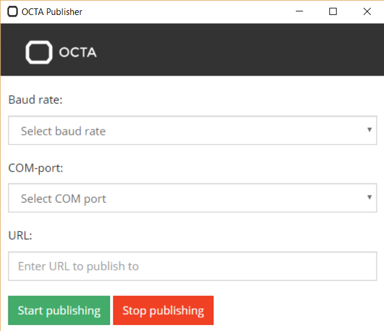

# Voortgangsverslag **Kevin Van de Mieroop**
## Controle-applicatie voor het OCTA-Connect open-source IoT-platform:
## Promotors
* Stagecoordinator: Tim Dams
* Stagebegeleider: Maarten Luyts
* Stagementor: Jens Vanhooydonck
* Stagepromotors: Thomas van Loon, Didier Verachtert, Jens Vanhooydonck

## Abstract
De opdracht die ik tijdens mijn loopbaan bij de Universiteit Antwerpen moet afkrijgen is een full-stack applicatie (Node.js, ExpressJS, AngularJS en MongoDB) die de metingen van een development board en bijhorende sensoren moet verwerken en visualiseren in de vorm van grafieken. De frontend zal behandeld worden door een third party service genaamd freeboard.io, die JSON-data binnenkrijgt en zelf refresht en verwerkt in verschillende soorten charts. De backend zal dus voornamelijk mijn verantwoordelijkheid zijn (het doorsturen naar de database en parsen van de data). Hieronder een schets van de architectuur, met in rood de hardware die door de postgraduaatstudenten behandeld wordt:  
 
 

## Technische omschrijving
In het tweede gedeelte heb ik veel moeten debuggen. Vooral omdat ik gebruik heb gemaakt van (voor mij) nieuwe technologieen. De keuze om alles in JavaScript te schrijven was ook niet vanzelfsprekend maar aangezien ik hier het meeste ervaring in heb werd het een goede optie aangezien de full stack in JS geschreven kan worden, inclusief een desktopapplicatie voor de publisher.

Na de vakantie heb ik samengezeten met Dragan Subotic, om de stand van zaken te bespreken. Hij wist me te vertellen dat de publisher en de subscriber al zeker in orde waren en dat dit vooral was wat ze nodig hadden. Om even te herhalen: de publisher wordt op de gateway-computer gestart. Die verzamelt de data via de seriele poort en stuurt ze door naar de backend. De backend (subscriber) subscribed op het mqtt topic waarop alle data wordt vervoerd en zet ze dan meteen in de database. Wat wel nodig was was dat de publisher in een .exe bestand gepackaged moest worden. Deze executable moest ook een mooie GUI hebben, en verschillende opties: de optie om de COM-poort te kiezen moest aanwezig zijn (de nu hardcoded COM-poort 7 is niet bij iedereen hetzelfde), men moest kunnen aanduiden wat de baud rate was waarop de seriele data binnenkomt (op de Arduino 9600, maar niet de rate waarop DASH7 data binnenkomt via de DASH7 module op de Gecko development board) en vooral ook een URL kunnen ingeven waarnaar de data gestuurd moest worden. Het dashboard dat ik aan het maken was, was een goed idee voor mijn bachelorproef zelf maar voor de toepassing die hij zocht was het niet echt noodzakelijk. Er bestaan third party diensten die dit voor jou doen en authenticatie hebben ingebouwd.

Het eerstvolgende dat ik heb gedaan is dus opgezocht hoe ik Node.js applicaties kan packagen in 1 executable. Hier bestaan verschillende modules voor: nexe (https://github.com/jaredallard/nexe): nexe zorgt ervoor dat de applicatie heel snel werkt, maar het nadeel hiervan is dat dynamische module requirements niet werken (wanneer er in een node.js applicatie wordt verwezen naar de te gebruiken modules). Een andere optie is EncloseJS (http://enclosejs.com/). EncloseJS is heel gemakkelijk te installeren en werkt ook met native modules, niet zoals nexe. Ik heb dus EncloseJS gebruikt om eens te testen of node.js executables een goede optie zijn voor mijn opdracht. Voor de publisher heb ik EncloseJS gebruikt: eerst globaal geinstalleerd met npm install -g enclose. Hierna is het heel simpel: de module kan simpelweg in gang worden gezet door als input (na enclose) het pad naar de node.js applicatie in te geven. Als output krijg je in de rootmap van de applicatie dan een executable met dezelfde naam. Als je deze runt krijg je dan simpelweg een command line venster waarin de applicatie runt. Dit is voorlopig zeer nuttig, omdat ik steeds de node command line moet openen en manueel moet veranderen naar de juiste map om daar "npm start" te runnen, maar voor de opdracht zelf heb ik hier niet veel aan. Er is geen GUI aanwezig, en er kan geen input gegeven worden door de gebruiker van de applicatie zelf. Hiervoor moest ik dus op zoek naar nieuwe modules of frameworks.

Voor het maken van een desktop applicatie heb ik 2 belangrijke opties gevonden: NW.js (voormalig gekend als node-webkit) en Electron. NW.js is een engine die de Node.js applicaties rechtstreeks vanuit het DOM runt (Document Object Model: een object-georienteerde structuurstandaard van bv HTML-bestanden die werd ontwikkeld omdat vroeger elke browser een eigen manier van toenadering had tot bestanden). De applicatie zelf wordt dus met webtechnologieen geschreven. De view is in HTML geschreven en de code die erachter zet, die de applicatie werkende maakt is in javascript geschreven. Het voordeel hiervan is dat modules met npm geinstalleerd kunnen worden en gebruikt kunnen worden zoals in normale Node.JS applicaties. Die worden dan uiteindelijk mee gepackaged in de distributable of deliverable. NW.js heeft een hoogsteigen engine waarop de applicatie loopt, die in essentie dus eigenlijk niets meer is dan een stripped down browser. Als je de basis nwjs executable opent, zie je dan ook een blank venster met de toolbar die wijst op een browservenster (deze toolbar kan verwijderd worden in het configuratie bestand). 
Electron is een bekender alternatief en loopt op vrijwel exact dezelfde manier, maar is volgens mij meer light weight en vooral omdat het bekender is, zal het ook meer support aanbieden in geval van obstakels. Applicaties die op Electron geschreven zijn: Slack, Postman, Stremio, Atom, Visual Studio Code, ... Dit zijn allemaal heel functionele, lichte applicaties die dan ook de esthetica aan hun kant hebben dus heb ik voor Electron gekozen. Door mijn ervaring in web technologieen is het de beste keuze.

Omdat ik eerst de architectuur moest bepalen van de laatste sprint en alle individuele nodes moest onderzoeken ging ik verder met de frontend vooraleer ik aan Electron begon. Zo waren er de verschillende services waartussen ik moest kiezen: Dashing, freeboard.io en Blynk waren de voornamelijkste opties. Dashing (http://dashing.io/) is vooral een heel simplistisch dashboard dat volledig customizable is. Hier een korte demo: http://dashingdemo.herokuapp.com/sample. De widgets kunnen zelf geschreven worden in scss, html of coffeescript en de data kan gepusht worden door gebruik te maken van hun API en het dashboard zelf kan eender waar gehost worden. Freeboard.io is een IoT dashboard dat volledig gratis is en door hen zelf gehost wordt. Het gemak hiervan is dat er gemakkelijk ingelogd kan worden en dat elke gebruiker zijn persoonlijke dashboard automatisch opent. De data kan van verschillende bronnen komen, voornamelijk een JSON bestand dat ergens anders gehost wordt (een andere belangrijke optie is dweet.io, een service die zorgt voor de opslag en routing van binnenkomende datapoints genaamd dweets. Hier hangt echter een maandelijkse kost aan vast als je ze wil opslaan). Een vorm van authenticatie is belangrijk voor de opdracht aangezien enkel persoonlijke data gevisualiseerd moet worden dus freeboard is al zeker een goede optie. Blynk is een mobile IoT dashboard dus als mobiel een vereiste wordt is dit de volgende integratie. Voorlopig is freeboard dus de gebruikelijkste optie.

Nu de architectuur bepaald was was het tijd voor de volgende belangrijke stap: er werd nog gebruik gemaakt van de dummy data die de Arduino doorgaf van een lichtsensor. Het bordje dat uiteindelijk gebruikt moet worden in een Gecko Giant development kit. Hieraan is een DASH7 module aan verbonden (ontworpen door de Universiteit Antwerpen zelf). De data komt van een OCTA Gateway die in een case zit, waaraan verschillende sensoren verbonden zijn. De bedoeling is dat deze cases op de daken van wagens van bpost worden gevestigd om zo om de 10 seconden data van de bijhorende sensoren binnen te krijgen. Deze data moet dan verwerkt worden. De gateway kan data van verschillende nodes binnenkrijgen waaraan verschillende sensoren kunnen hangen dus de vorm van binnenkomende data ligt niet vast. Om de applicatie te maken krijg ik nu de data binnen van deze bpost case. Hieraan hangt een VOC-meter (volatile organic compound, organische stoffen die in de lucht aanwezig kunnen zijn en eventueel schadelijk kunnen zijn voor de mens en/of natuur of omgeving), een CO2 sensor, een lichtsensor, een termistor en een gps module. De gateway stuurt om de 10 seconden een pakket door met data van al deze sensoren.
Ik kreeg dus een Giant Gecko dev board met hierop de DASH7 module. Didier had voor mij alles geconfigureerd en voorzien dat de data via seriele communicatie binnenkwam, zodat ik me niet moest bezighouden met hardware en low-level programmering van het bordje. Ik kon mijn eigengemaakt publisher gebruiken (waar een serial monitor in zat door de serialport module die rechtstreeks alles wegschreef naar de console) om de binnenkomende data te laten zien. De lengte van de binnenkomende strings varieerde sterk en het was snel duidelijk dat de pakketjes niet volledig waren. Na wat rondbewegen in het lokaal om beter bereik te zoeken werd dit vermoeden snel bevestigd: ik ging beneden zitten in de gang toen er wel volledige pakketjes binnenkwamen. De bpost doos met gateway staat namelijk in de bureau een verdiep lager, en onze bureau staat nog op een mezzanine dus het bereik was allesbehalve ideaal. Het probleem was dat ik niet altijd beneden kon zitten omdat er niet ten alle tijden een bureau beschikbaar was, en de bpost case was ook niet altijd aanwezig in het gebouw. 
Ik spitste me dus voorlopig toe op de applicatie zelf. Ik had reeds gekozen voor Electron dus begon ik volop met hierover onderzoek te doen. 

Electron is een open-source framework om desktop applicaties te bouwen op de Chromium engine (afgeleide code van de Google Chrome browser). Het grote voordeel is dus dat het cross-platform werkt en de geschreven applicatie bij iedereen op dezelfde basis werkt. Er moet dus geen rekening gehouden worden met verschillende (besturings)systemen. Een basis Electron applicatie heeft een bepaalde structuur nodig: een main.js bestand, een index.html bestand en een package.json bestand. In het index.html bestand wordt de view voorgesteld. Deze wordt dus gewoon in html geschreven alsof men een webpagina aan het schrijven is. Een css bestand kan hier dus uiteraard ook aan gekoppeld worden om de layout te verzorgen. Bootstrap en dergelijke kunnen hier ook aan toegevoegd worden. De code van de applicatie zelf bevindt zich vooral in het main.js JavaScript bestand. 

               const electron = require('electron')
               // Module to control application life.
               const app = electron.app
               // Module to create native browser window.
               const BrowserWindow = electron.BrowserWindow
               
In de header van het main.js bestand worden de referenties gemaakt naar noodzakelijke modules. Merk op dat dit heel gelijkaardig is aan een node.js bestand met de require functie om externe modules te integreren.
Met de functie createWindow() wordt het venster geinitialiseerd, inclusief de grootte ervan. Deze 2 onderdelen zijn het belangrijkst om een electron app te maken. Andere belangrijke functies zijn de app.on() en app.quit() functies. Het debuggen (of gewoonweg runnen) van de applicatie voordat ze gepackaged wordt werkt als volgt: in de root van de applicatie zelf wordt in een command line venster het commando "electron" gerund (nadat electron globaal of lokaal geinstalleerd is via npm install electron-prebuilt). Zo open je dit venster:  
  
*Zoals het venster zegt moet enkel het main.js bestand gesleept worden naar het venster en zo wordt de gehele applicatie geopend.*

Ik heb een simpele view gemaakt waarin een form zit verwerkt. In deze form kunnen de opties van de publisher gekozen worden: de baud rate kan ingesteld worden, de COM-poort en de URL waarnaar gepublisht moet worden kan worden ingesteld. Als alles ingevuld is kan er op de groene knop gedrukt worden om de data te beginnen uitlezen en rechtstreeks naar de mqtt broker te sturen. Hier een screenshot van het venster: 
 
*Dit is dus een zeer basic (enkel de noodzakelijke elementen) Electron applicatie.*

Een groot probleem deed zich voor vanaf het moment dat ik de modules begon te installeren. Het plan was om de code van de oorspronkelijke publisher er in te verwerken zodat er eerst hardcoded de baud rate 9600 werd gekozen en COM-poort 7. De data werd automatisch gepublisht op het oude "lightmeasuring" topic van de mqtt broker (vanhooydonck.nu van Jens). 
Wanneer ik de serialport module installeerde en integreerde in de app (var sp = require('serialport')) kreeg ik een DLL initialization routine error: 
 
Na de error de googlen werd snel duidelijk dat ik niet de enige was met dit probleem. De oorzaak was niet meteen duidelijk maar veel mensen hadden succes door gewoonweg de applicatie enkele keren opnieuw te builden. Na deze raad opgevolgd te hebben kreeg ik nog steeds dezelfde foutmelding. Opnieuw waren er meerdere personen bij wie het probleem bleef bestaan. Enkelen onder hen hadden een aangepaste versie van de serialport module gemaakt, specifiek voor electron (https://github.com/voodootikigod/node-serialport is de originele actieve module en https://github.com/usefulthink/node-serialport is een forked versie hiervan die tegen de Electron runtime werd gemodifieerd). Na deze te installeren kreeg ik een andere error, namelijk dat de module niet werd gevonden. Na opnieuw de originele module te installeren om de applicatie toegang te verlenen tot het serialport.node bestand zelf, kreeg ik opnieuw de gevreesde DLL error. Na dieper in te gaan op het probleem om zelf een oplossing te zoeken, bleek het aan de manier waarop de serialport module was gebouwd te liggen. Oorspronkelijk werd de module gebouwd op basis van node-gyp, een project dat simpelweg toeliet om addons aan node toe te voegen. Het probleem hierbij was dat er veel dependencies niet automatisch werden geinstalleerd en er kwamen veel klachten binnen door gebruikers over hoe ze het op hun besturingssysteem moesten installeren. Dit heeft voodootikigod (de maker van de serialport module) opgelost door de veranderen naar het node-pre-gyp project; gelijkaardig aan node-gyp. Het verschil is dat pre-gyp kan steunen op lokale dependencies als ze niet globaal zijn geinstalleerd op de pc van de gebruiker. Pre-gyp is echter niet meteen compatibel met electron.
Na specifiek dit probleem op te zoeken had ik een pakket gevonden dat een gehele electron applicatie kan rebuilden tegen de juiste versies. Electron-rebuild had ook een optie voor dit specifieke probleem, namelijk --pre-gyp-fix. Veel hielp dit niet en ik kreeg nog steeds de DLL fout. 
Aangezien ik veel tijd was aan het verliezen met dit probleem, besliste ik alternatieven op te zoeken. NW.js was nog steeds een optie en na online opzoekwerk te plegen bleek het compatibel te zijn met het node-pre-gyp project. 
Na wat research over nw.js leek het niet moeilijk om een project te starten. Men moet enkel een basis nw.js applicatie downloaden, en de nodige bestanden aanpassen. Er zit zelfs reeds een nwjs executable in die alle nodige files opent en is dus gemakkelijker te debuggen dan Electron (wat op het moment van dit te typen nog maar net over in versie 1.0 is gegaan). Ik kopieerde de code over en eveneens de html code om de view hetzelfde te maken. De code werkte nu perfect. De opties worden doorgegeven via een form met een submit knop en er zijn 2 individuele functies die de serialport en de mqtt module aansturen. De ene start het proces, en de andere stopt het proces. Het probleem is dat het basis nw.js project zeer groot is gepackaged wordt het een setup bestand. Dit zou simpeler moeten en zou gepackaged moeten worden in een enkele executable. 
Eerst kon ik overschakelen naar het belangrijkste onderdeel: de overschakeling naar het Gecko bordje; aangezien de bpost doos opnieuw beschikbaar was. Ik ben 1 dag beneden gaan zitten en heb dan meteen een parser gevraagd. Deze parser was echter in python geschreven dus moest ik hier wat analyse-werk doen. Ik volgde een korte course van Python op codecademy om de basics onder de knie te krijgen.
Hieronder een stuk van de parser:

    sensor_data_bytes = [
        0xe6, 0x16, 0x95, 0x43,       # temperature
        0x9a, 0x99, 0x6d, 0x44,       # light
        0x25, 0x00,                   # RH
        0x9c, 0x16,                   # CO2
        0x00, 0x00,                   # VOC
        0x8f,                         # sum
        198, 229, 76, 66,             # lat
        128, 55, 141, 64              # lon
        ]

En dit is een screenshot van de serial monitor via de publisher (met baud rate 115200): 
 

De langste string (en vaakst voorkomende) is 82 karakters lang. Dit is dus de lengte van een normaal pakket. 82 karakters lang in hexadecimaal (2 karakters per byte) wil zeggen dat 1 volledige string 41 bytes lang is.
Uit de snippet van de parser kan afgeleid worden dat de volgorde van de data in de string als volgt is: eerst de temperatuur, dan de hoeveelheid licht, dan de RH-waarde, dan de hoeveelheid CO2, dan de VOC, dan een checksum en dan de coordinaten (eerst latitude dan longitude). Respectievelijk zijn deze data 4, 4, 2, 2, 2, 1, en 8 (2 keer 4) bytes groot. 
Ik heb 1 pakketje apart genomen om deze te ontleden. 

       <Buffer 44 04 87 00 00 20 24 e4 c3 04 54 ef 97 b7 20 40 00 17 db 07 97 43 e1 7a 16 44 1f 00 fa 00 c2 01 4d b4 e5 4c 42 f7 37 8d 40>
       
Achteraan beginnend: 4 bytes stelt de longitude voor (f7 37 8d 40), dan 4 bytes latitude (b4 e5 4c 42), dan de checksum (4d), dan de VOC (c2 01), dan de CO2 (fa 00), RH (1f 00), lichthoeveelheid (e1 7a 16 44), en temperatuur (db 07 97 43). Het device ID nummer staat ervoor (24 e4 c3 04 54 ef 97 b7).
Na een simpele controle lijken de waarden niet te kloppen. Wanneer f7378d40 (zogezegd longitude) wordt omgezet naar decimaal wordt de waarde 4147612992 verkregen. Dit klopt niet met de waardes die google maps geeft na controle. Ik gebruikte de site Scadacore (http://www.scadacore.com/field-applications/programming-calculators/online-hex-converter/) om een hex string te analyseren en in alle mogelijke vormen omzet (bytes, ints, en floats van verschillende bit significance). Hier blijkt het te gaan om een *Little Endian Float (DCBA)*. Dan wordt de verkregen waarde 4.41308165. Dit kan wel kloppen. De latitude (b4e54c42) wordt dan 51.22432. Volgens google maps komen deze coordinaten uit op exact het lokaal waar we zitten op de campus Paardenmarkt. Hieronder ter verduidelijking een volledig schema van een binnenkomend DASH7 pakket:  
 

Omdat dit veiliger is, zet ik de rauwe data rechtstreeks in de database. Als er zo iets moet veranderen aan de parser zelf, klopt de database zelf nog en blijft de vorm van elementen homogeen doorheen de database.
Wel zal ik filteren, en de buffers omzetten naar een samenhangende string. Dit doe ik simpelweg door ze de parsen naar een hex string met toString('hex'). Er blijven nog steeds onvolledige pakketten binnenkomen die dan ook zo in de database worden geplaatst. Dit vermijd ik door de grootte van de string te vergelijken met een volledig pakket: een volledige string bestaat uit 41 bytes en dus 82 karakters, de rest wordt gedropt. In de console staan ze dan als "undefined"; deze mogen niet in de database worden geplaatst.

        var filteredstring;
        if (datastream.length == 82)
        {
            filteredstring = datastream;
        }
        console.log(filteredstring);
        if (filteredstring != null)
        {  
            collection.update( 
            ...

In de snippet hierboven worden de onvolledige pakketjes eruit gefilterd, en enkel diegene met een waarde worden in de database geplaatst. Hieronder een screenshot van de database met ongeparsede data (via Postman): 
 

Het laatste dat moet gebeuren is het weergeven in freeboard. Hier kan gemakkelijk verwezen worden naar een json bestand dat automatisch bijgewerkt wordt. Dit is dan ook het laatste dat ik tot nu toe heb gedaan, voorlopig zonder succes. De console geeft als error weer dat een https adres wordt verwacht bij de datasource. Ik moet dus poort 443 openzetten op de server vooraleer freeboard aan de data kan geraken. Dit is het volgende dat zal gebeuren.

## Extra informatie
### Bijscholingen
Codecademy: Python geleerd (3 units om basic syntax te leren zodat parser verstaanbaarder is) (https://www.codecademy.com/learn/python)

### Nieuwe contacten
Jens Vanhooydonck,
Thomas Van Loon,
Didier Verachtert,
Glenn Ergeerts,
Dragan Subotic,
Maarten Weyn

### Literatuur
Codecademy (http://www.codecademy.com) 
Stack Overflow (http://www.stackoverflow.com) 
Scadacore (http://www.scadacore.com/field-applications/programming-calculators/online-hex-converter/) 
Electron quick start(https://github.com/electron/electron-quick-start) 
NW.js documentation (http://docs.nwjs.io/en/latest/) 
Voodootikigod (creator of serialport module) on Maintaining a Native Module (http://www.voodootikigod.com/on-maintaining-a-native-node-module/) 
Electron (http://electron.atom.io/) 
NW.js (http://nwjs.io/) 
Freeboard.io (https://freeboard.io/) 
Dashing (http://dashing.io/) 
Blynk (http://www.blynk.cc/) 
Google (http://www.google.com)

