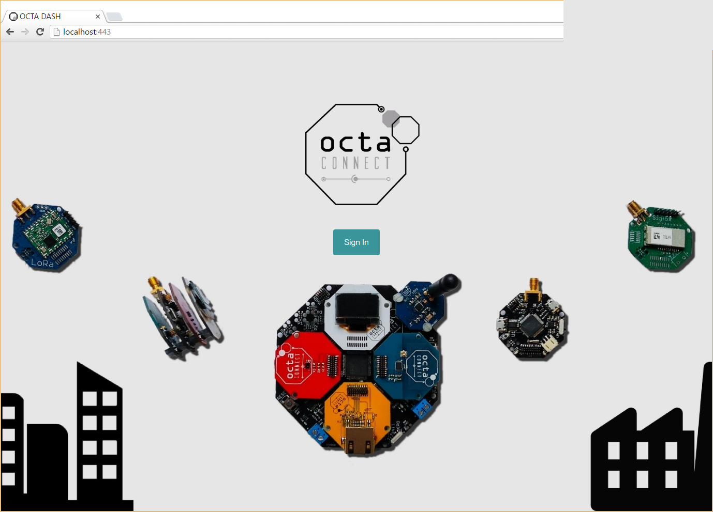
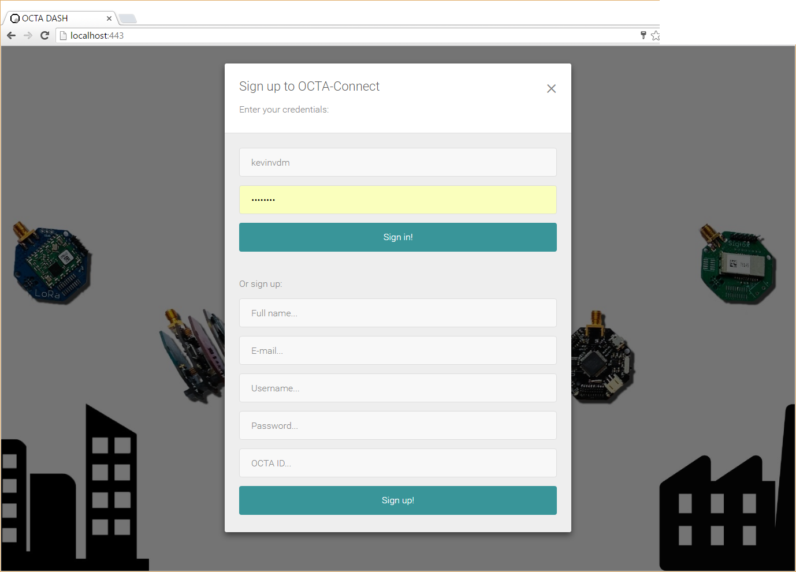
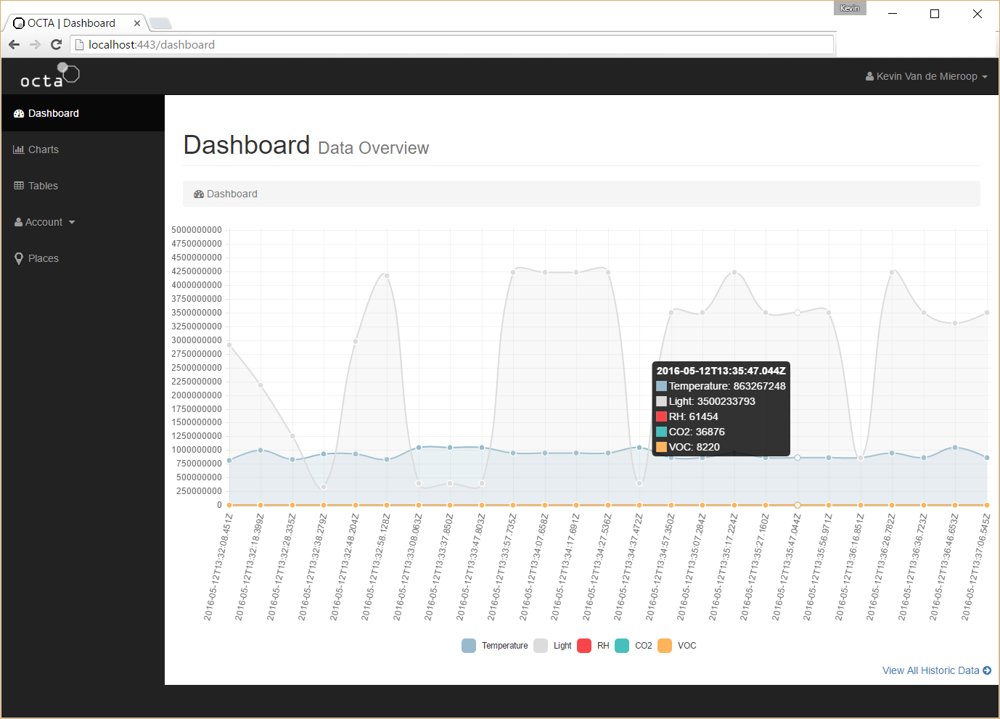
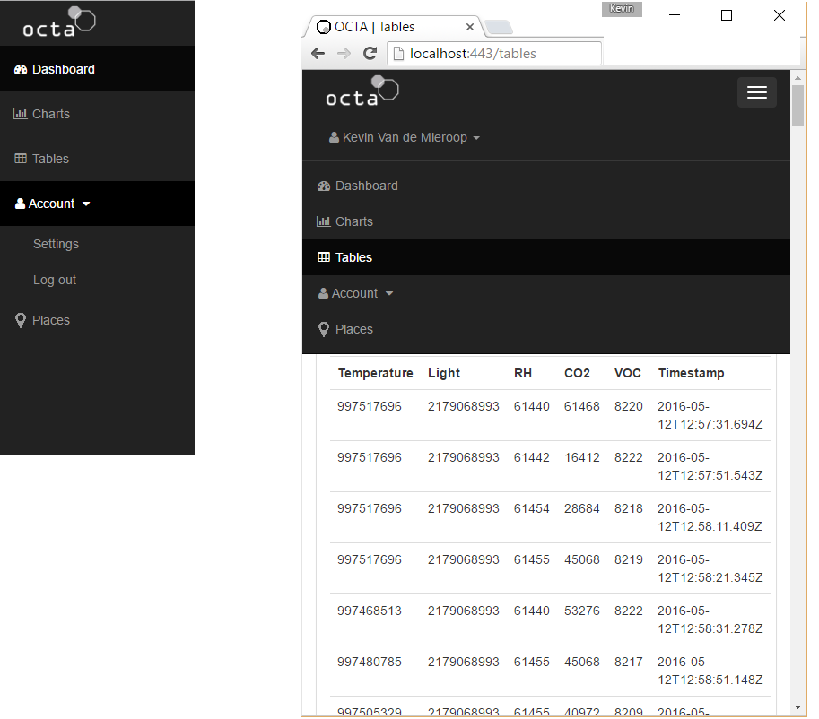
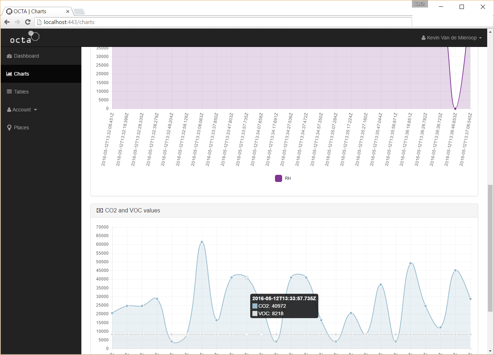
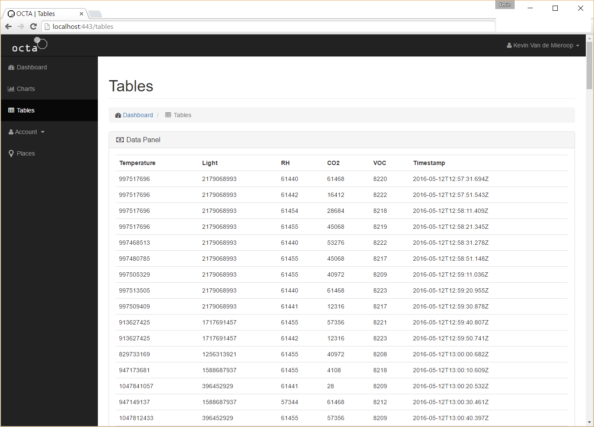
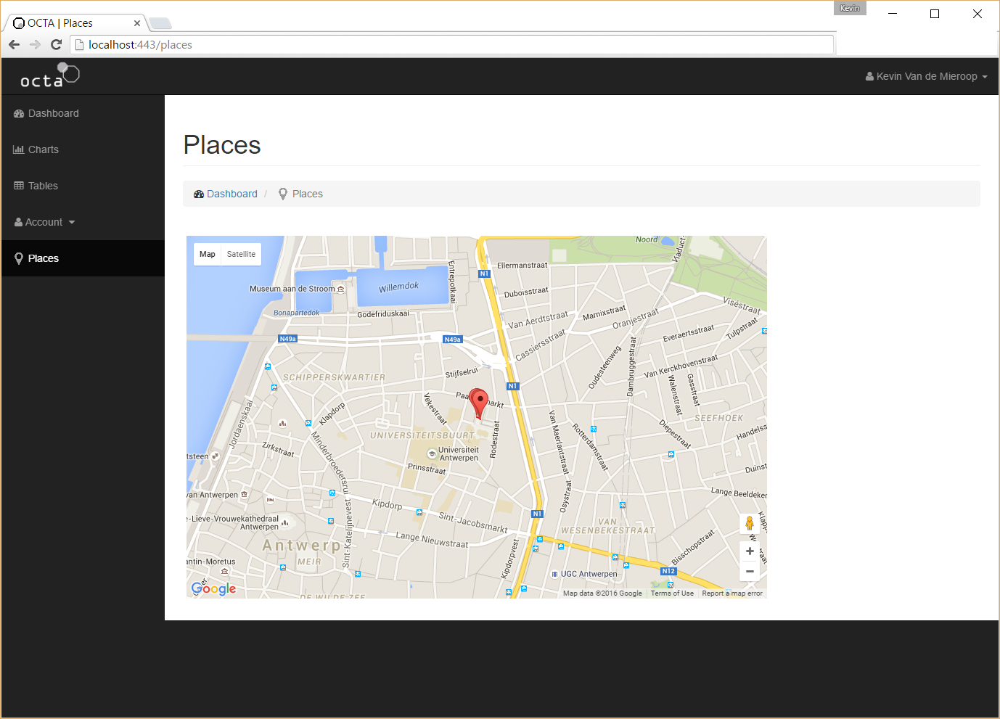
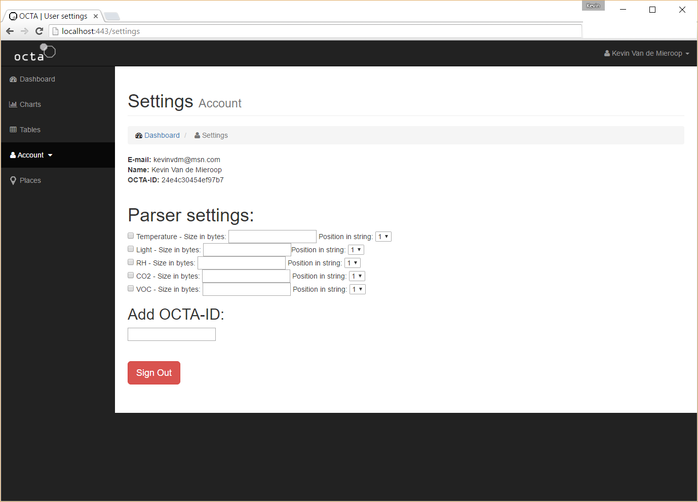

# 5. Conclusie en samenvatting

## 5.1 Conclusie & resultaat
In dit hoofdstuk zal de front-end van de applicatie in zijn geheel, en elke functie ervan getoond worden. Elke pagina zal uitgelegd worden en wat erop staat.

De applicatie is uiteindelijk verwezenlijkt kunnen worden met alle features die oorspronkelijk aanwezig moesten zijn. Ze zal gehost worden op Heroku zodat ze toegankelijk is voor iedereen. Een account kan gemakkelijk aangemaakt worden. Om het platform zelf te gebruiken is wel een geldige OCTA-ID nodig, aangezien er anders geen data binnen zal komen. Eerst zal de applicatie voorgesteld worden hoe ze er nu uit ziet. Elke pagina wordt besproken om zo het nut ervan duidelijk te maken. Daarna zal gekeken worden hoe de applicatie eventueel verbeterd zou kunnen worden.

### 5.1.1 Desktop applicatie

 *Fig. 4: Desktop applicatie* 

De desktop-applicatie wordt geinstalleerd aan de hand van een setup. De executable wordt dan geopend om bovenstaand venster te krijgen (Fig. 23). Hier wordt de COM-poort geselecteerd waar de gateway op is aangesloten, en de baud rate ervan (standaard 115200). Eventueel kan een URL ingegeven worden indien er een third-party dashboard gebruikt wordt in plaats van de ontwikkelde Angular applicatie. Op de groene button kan geklikt worden om de publishing-functie uit te voeren, en wanneer het publishen gestopt moet worden kan op de rode button geklikt worden. Indien de applicatie begint met publishen, zal de data doorgestuurd worden naar de MQTT broker. Deze houdt de data bij op een topic. De backend subscribet op dit topic en zet de ontvangen data meteen in een database. De database wordt doorgegeven aan de front-end, die nu uitgelegd zal worden:

### 5.1.2 Web-based applicatie

De index ziet er zo uit:

 *Fig. 24: Splash screen* 
 
Hier kan ingelogd worden door de modal te openen. Wanneer de modal geopend wordt ziet de login er zo uit:

 *Fig. 25: Login modal* 

Hier kan een account aangemaakt worden en ingelogd worden. Als er een fout is met de login (verkeerde gebruikersnaam of paswoord) of de registratie (gebruikersnaam bestaat reeds), wordt de index opnieuw geladen. Als de login succesvol is wordt er naar het dashboard verwezen:

 *Fig. 26: Dashboard* 
    
Hierin staan gewone grafieken. Links staat een sidebar/menu, die zichzelf inklapt als er een mobiel scherm gedetecteerd wordt:

 *Fig. 27: Menu. Links de desktopversie, rechts de mobiele versie* 
    
Door op charts te klikken verschijnt een grafiek met alle laatste 25 datapunten. Deze worden allemaal geladen door angular-chart.js, en zien er zo uit:

 *Fig. 28: Charts* 

In de link *tables* zit volgende pagina:

 *Fig. 29: Tabellen* 
    
Hierin wordt een lijst opgeroepen met alle individuele datapunten in een tabel en de bijhorende timestamp. Er is nog een pagina genaamd *places*, waarin de coordinaten in een Google Map worden geladen Hiervoor werd de Google Maps API gebruikt, en worden de laatste 5 coordinaten in geladen als markers. Tussen de markers wordt een *traceroute* getrokken om de route aan te duiden die de gps-module heeft gevolgd:

 *Fig. 30: Places* 
    
Op de *Account* pagina kan de gebruiker uitloggen. Hier komen in de toekomst nog meer opties, zo om bijvoorbeeld de parser in te stellen zodat de pakketjes die binnenkomen persoonlijk kunnen worden. Momenteel is het een statische parser. Ook de mogelijkheid om meer OCTA-Gateways toe te voegen zal hier komen.

 *Fig. 31: Settings* 
    
Rechtsboven staat op alle paginas een welkomstbericht en de mogelijkheid om gemakkelijk uit te loggen op elke pagina.

### 5.1.3 Hoe zou het verbeterd kunnen worden?

* Een dynamische parser zou geimplementeerd moeten worden. Dit wil zeggen dat de pakketjes in de toekomst er anders zouden kunnen uitzien. De parser is momenteel statisch; er wordt gekeken naar de positie van alle karakters in de binnenkomende string en zet ze dan individueel in een variabele die getoond zal worden. De parser zou dan ingesteld kunnen worden op de account pagina van de ingelogde gebruiker.
* Er zou ondersteuning moeten komen voor de API's van het LoRa en het SigFox netwerk. Hiervoor wordt momenteel een individuele backend gebruikt waarop alle data binnenkomt maar zou evengoed geimplementeerd kunnen worden in deze applicatie.
* De parser staat nog niet volledig op punt. De endianness van de data wordt correct omgekeerd van groot naar klein, de data wordt eerst naar integer omgezet om dan naar floating point te worden geparsed, maar de data wordt nog steeds niet correct getoond. De onderlinge verhoudingen zijn echter correct dus de grafieken en tabellen doen wat ze moeten doen, en verschillen kunnen gemakkelijk opgespoord worden.

## 5.2 Samenvatting
Deze scriptie draait rond het concept Internet of Things. Rond dit idee werd OCTA-Connect geboren, een development board ontwikkeld door enkele onderzoekers aan de Universiteit Antwerpen, waarbij verschillende sensoren data verzamelen en doorsturen naar een gateway. Voor dit platform werd een controle-applicatie of monitoring applicatie geschreven.

De OCTA-Connect Gateway wordt aangesloten op een PC, die de data doorstuurt naar de publisher application over USB. De publisher application is een desktop-applicatie ontwikkeld met Node.JS op de Electron runtime, en stuurt de data rechtstreeks door over MQTT naar de broker. Deze broker behandelt de data en zal ze verdelen onder alle subscribers. De subscriber hier is de volledige backend, die in JavaScript geschreven is op het Node.JS framework. De backend slaat de data op in een Mongo database.  
Een gebruiker maakt een account aan op de AngularJS-based front-end. De authenticatie hiervan wordt eveneens behandeld door de backend, die de gebruikersinformatie opslaat in dezelfde Mongo database (weliswaar in een andere collectie). Als de authenticatie succesvol is, wordt alle data van deze gebruiker doorgegeven en geladen in de front-end. De data wordt dan overzichtelijk getoond in de vorm van grafieken.

Hieronder nog eens de uiteindelijke architectuur van de gehele applicatie:

