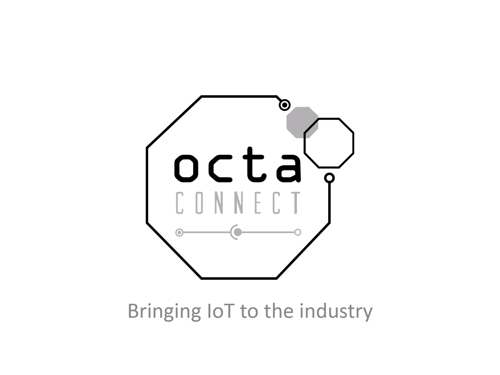
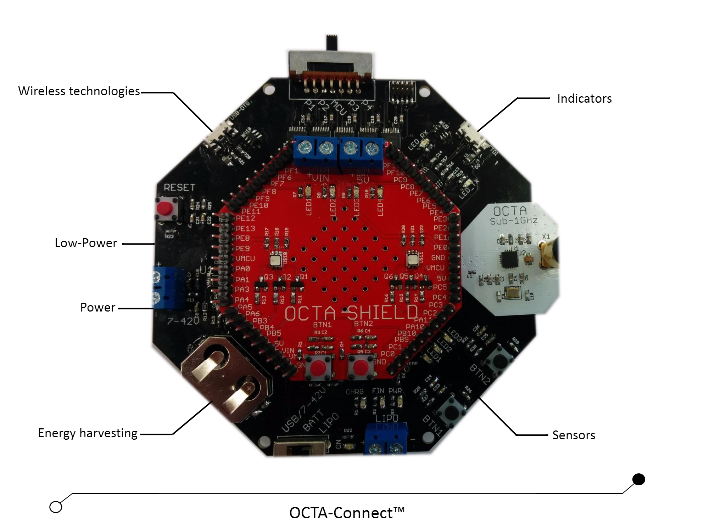

# 3 Introductie
Deze bachelorproef draait vooral rond 1 onderwerp: het Internet of Things. IoT is een concept dat ontzettend snel is gegroeid: het is onmisbaar omdat het voor ontelbare problemen een oplossing biedt. Het is vooral ook een breed onderwerp: het verbinden en met elkaar laten communiceren van alle toestellen. De hardware is hiervoor belangrijk, maar even belangrijk is ook de (embedded) software. De onderzoeksgroep elektronica-ict van de Universiteit Antwerpen spitst zich hier dan ook op toe. Ze behandelen en onderzoeken verschillende protocols om modules data aan elkaar te laten doorgeven. Een platform dat door hen zelf werd ontwikkeld is OCTA-Connect.

## 3.1 Universiteit Antwerpen
Breed gesproken: de UAntwerpen is een van de 2 grootste universiteiten van België en heeft een zeer breed aanbod van diploma's. Ze heeft echter ook een hele hoop onderzoekgsgroepen die experimenteren in verschillende wetenschappen.
Wat meer over de onderzoeksgroep elektronica-ict van de UAntwerpen. Ze spitsen zich dus toe op embedded systemen ontwikkelen. Het team, geleid door professor Maarten Weyn van de UA, bestaat uit programmeurs die elk een eigen specialiteit hebben. Een belangrijk project is het City of Things: sensoren in de stad plaatsen om zo verschillende waarden constant op te meten en algemene data te verzamelen op verschillende plekken in de stad. Zo plaatsen ze sensoren in de Velo-pilaren doorheen Antwerpen om bijvoorbeeld luchtkwaliteit op te nemen en deze via het LoRa-netwerk door te sturen. Het biedt verschillende mogelijkheden:  

  * Nieuwe netwerktechnologieeen testen op een groot gebied.
  * Ontzettend veel data verkrijgen die zorgt voor nieuwe informatie.
  * Antwerpenaren actief laten meedoen met field tests, en zo automatisch een groot genoeg publiek creëren die betrouwbaardere data geeft.

## 3.2 OCTA-Connect
 
OCTA-Connect is een Internet of Things platform dat bestaat uit een OCTA-Connect gateway, een OCTA mini en diverse sensoren om data te verzamelen.
Verschillende nodes (OCTA-mini) verbinden met de OCTA-gateway en geven elk data door. Aan de nodes kunnen willekeurige sensoren worden gekoppeld en communiceren hiervan de data (b.v. temperatuur) via onder andere DASH7 door aan de gateway. Deze gateway is met een UART verbonden met de computer van de gebruiker.  
Hier past dit project in: de data moet meteen worden doorgegeven aan een backend die de data behandelt en ze in een database steekt. De data kan daarna via een dashboard worden opgehaald in de vorm van grafieken en historic data. Deze data wordt ook geparsed om verstaanbaar gevisualiseerd te worden.

Een voorbeeld van een project dat uitgevoerd kan worden met het OCTA-Connect platform in combinatie met het DASH7 Alliance protocol is het bird tracking project (*DASH7 Alliance Protocol in Monitoring Applications*). Hier werd een endnode ontwikkeld, zo klein dat het kon gevestigd worden op een klein vogeltje. Het vogeltje werd getracked vanaf geboorte om te zien waar het een nest zou bouwen. De endnode stuurde de locatie van de vogel met een tijdsinterval door naar een sub-controller die dan op zich de data naar een gateway (300-400 meter verder) verzond.

### 3.2.1 OCTA gateway
*Fig. 1: OCTA-Connect Gateway* 
De "core" van het idee van OCTA-Connect is *modulariteit*. Dit wil zeggen dat alle modules "stackable" zijn; op de gateway kunnen voorgemaakte modules gekoppeld worden door ze gewoonweg op elkaar te stapelen. Zo is er een LoRa-module, een DASH7-module, een Sigfox-module, en zo verder. Deze modules behandelen dus elk een eigen protocol om zo data van verschillende bronnen binnen te kunnen krijgen.

De gateway zelf kan geprogrammeerd worden aan de hand van een eigen OCTA IDE, die te vinden is op de *Downloads*-pagina van OCTA-Connect (http://octa-connect.com/download.php).
 

### 3.2.2 Controle-applicatie
Dit project draait rond een monitoring applicatie die gebruikt kan worden bij een OCTA-Connect Gateway. De data wordt gegenereerd door sensoren die op een OCTA-mini zijn aangesloten. Deze OCTA-mini stuurt de data door naar de OCTA-Connect Gateway die op zijn beurt aangesloten is op een PC. De gateway verstuurt de data over MQTT naar de backend, die de data in een database zet. De gebruiker kan zijn data, in de vorm van grafieken en tabellen, oproepen door in te loggen op het Angular-based platform.

De werking van de applicatie en het ontwikkelproces ervan zal in detail worden besproken in dit document. Tijdens de ontwikkeling werd een OCTA-Connect gateway gesimuleerd aan de hand van een Giant Gecko development board gepaard met een DASH7 module. De module is exact dezelfde die op een OCTA-Connect gateway zal zitten dus de werking en de verwerking van de data zal op dezelfde manier gebeuren. De data die tijdens dit project binnenkomt is afkomstig van een OCTA-mini die in een waterproof casing zit samen met een GPS-module, een lichtsensor, een CO2-sensor, een temperatuursensor, een VOC-sensor en een RH-sensor. Deze doos is onderdeel van een afzonderlijk project in samenwerking met bpost: verschillende dozen worden gevestigd op verschillende postwagens om zo data op te nemen en door te sturen terwijl de wagen rondrijdt. Het biedt een goed voorbeeld van een toepassing voor het platform en daarbij ook data die in deze applicatie gebruikt kan worden; alle data in dit document zijn dus hieruit afkomstig.