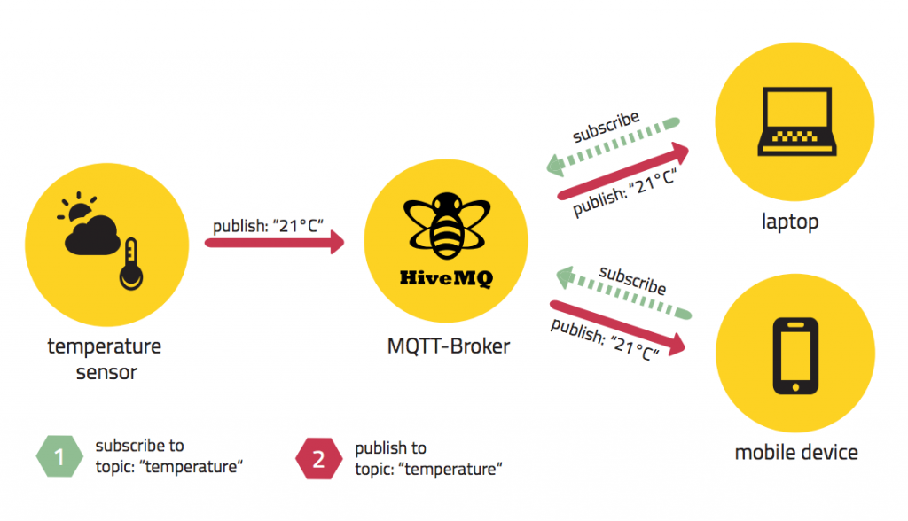

## 4.3 Ontwikkelproces & gebruikte technologieen 
In dit hoofdstuk zal in detail en in min of meer chronologische volgorde worden uitgelegd hoe de applicatie ontwikkeld werd. Bij elke stap zal meer (eventueel achtergrond-)informatie worden gegeven over de module en eventuele alternatieven. We gaan uit van de basis van het platform; zowel client-side als server-side zijn gebouwd met hetzelfde JavaScript framework.

### 4.3.1 Communicatie

Een van de belangrijkste onderdelen van elke Internet of Things applicatie is zonder twijfel **communicatie**. De manier waarop de verschillende onderdelen met elkaar praten is zeer belangrijk; aldus het protocol. Alle protocollen voor datacommunicatie passen binnen een referentiemodel genaamd het OSI (Open Systems Intercommunications) model. Deze bevat verschillende lagen, ofwel (fysieke en logische) stadia:

* Toepassingslaag (b.v.: Network File System (NFS))
* Presentatielaag (b.v.: HyperText Markup Language (HTML))
* Sessielaag (b.v.: Telnet)
* Transportlaag (b.v.: MQTT)
* Netwerklaag (b.v. IPv4)
* Datalinklaag (b.v. IEEE 802.2, LoRa)
* Fysieke laag (b.v. USB, LoRa)

Van deze lagen zal dieper worden ingegaan op de vierde laag, waar de volgorde en segmentatie van de berichten worden bepaald. Hier zit het MQTT-protocol, wat voor de applicatie gebruikt zal worden om te communiceren tussen de publisher-applicatie en de backend.

#### 4.3.1.1 MQTT

MQTT (voormalig MQ Telemetry Transport) is het protocol dat het vaakst gebruikt wordt bij projecten omtrent Internet of Things. De werking ervan draait vooral rond de MQTT broker: deze krijgt berichtjes binnen (gewoonlijk zeer korte berichtjes van enkele bytes lang), en verdeelt ze dan weer onder diegenen die willen. Hier zijn benamingen voor, gelijkaardig met een forum: diegenen die berichtjes versturen zijn de publishers; zij publishen berichten op een bepaald topic. Diegenen die de berichtjes willen lezen zijn de subscribers; zij subscriben op een bepaald topic en krijgt real time de berichtjes binnen als er nieuwe worden gepublisht op het gewenste topic. Zelfs veelgebruikte instant messaging of chat-applicaties zijn opgebouwd rond MQTT; zoals Messenger van Facebook.

MQTT biedt drie verschillende niveaus van Quality of Service aan. Dit wil zeggen wat de module kan aanbieden in mate van features. Hoe hoger de Quality of Service, hoe complexer het wordt en hoe meer het vergt van de server (hier de broker):

* QoS 0: "At most once"; het bericht wordt eenmalig verstuurd vanaf de publisher, de subscriber kan het  eenmalig ontvangen
* QoS 1: "At least once"; het bericht wordt bijgehouden door de afzender totdat een acknowledgment is teruggekregen (PUBACK)
* QoS 2: "Exactly once"; het bericht wordt gepublisht: PUBREC(eived) flag, dan een PUBREL(eased) flag, en ten slotte een PUBCOMP(leted) flag

Om kennis te maken met het principe en de werking ervan zal in het onderdeel *Software* een korte demo worden uitgelegd die de basis vormt van de applicatie. Vooraleer aan de software begonnen kan worden, zal er eerst een broker vastgesteld moeten worden die gebruikelijk is voor de demo. Hiervoor bestaan verschillende alternatieven:

###### HiveMQ
 *Fig. 5: Schema van een HiveMQ opstelling (Bron: www.hivemq.com)*  

Een third-party service die gratis hun servers aanbiedt om gebruik te maken van brokers. Persoonlijk gebruik ervan is gratis; een licentie is echter vereist voor een commerciele applicatie.

###### Mosquitto
 
    
Een open-source tool die in een console venster loopt op een eigen server. Zeer gemakkelijk en licht, dus de snelheid waarop data passeert hangt volledig van de server af.

In dit project zal steeds Mosquitto gebruikt worden. Aanvankelijk zal het lokaal gedraaid worden, maar daarna wordt een nieuwe broker geinitialiseerd op een externe server.

### 4.3.2 Software

#### 4.3.2.1 Node.JS

 

De fundering van zowel de desktop-applicatie als de web-based applicatie en dus van dit gehele project is Node.JS. Voornamelijk bedoeld om server-side applicaties te ontwikkelen die web-based zijn, is Node.JS een enorm populair en veelzijdige runtime waarop ook desktop applicaties gebouwd kunnen worden. Applicaties gebouwd op Node.JS werken asynchroon, wat ervoor zorgt dat enorm veel threads of uitvoeringen tegelijk kunnen draaien (met 1 hoofd-thread die wordt geinformeerd als er een thread in de *threadpool* zijn taak heeft uitgevoerd). 
Node.JS is gebouwd op de V8 engine om JavaScript uit te voeren. Deze werd op zijn beurt gebouwd voor Google Chrome, en werd in 2008 open-source gemaakt door Google zelf. In plaats van het rechtstreeks uit te voeren zet de V8 engine de JavaScript code eerst om naar machine code.

In Node.JS zit een ingebouwde package manager, simpelweg genaamd Node Package Manager (**npm**). Hiermee kunnen alle, inclusief non-officiële, modules worden gedownload, geinstalleerd, verwijderd en gemodifieerd. De modules dienen niet als code, maar worden gezien als *dependencies*, waarnaar verwezen wordt in de applicatie zelf zodat functies van die dependencies gebruikt kunnen worden (te vergelijken met libraries). Deze dependencies worden opgeslagen in de folder **node_modules**, en opgenomen in het **package.json** bestand van de applicatie. Ook algemene taken die de applicatie moet uitvoeren zijn hierin terug te vinden.
Bijvoorbeeld: normaliter moet elke Node.JS applicatie opgestart worden met 

    node app.js
    
waarin *node* het commando dat die uitgevoerd wordt (node moet het dus openen) en app.js de effectieve applicatie is die gestart moet worden. In het package.json bestand kan dan een variabele worden toegvoegd aan het *scripts* object: start betekent "node app.js" daarna moet enkel

    npm start
    
worden ingegeven om de applicatie te doen lopen. Hier bestaat echter een beter alternatief voor, maar het geeft een beeld van het nut van het package.json bestand.

###### Nodemon

Nodemon (nodemon.io) is een module die veranderingen in een Node.JS applicatie automatisch opspoort. Wanneer veranderingen worden gevonden, wordt de applicatie opnieuw opgestart. Zo moet de Node.JS service niet telkens worden stopgezet a.d.h.v. *Control-C*. De module wordt globaal geinstalleerd via npm, en de applicatie wordt nu op deze manier opgestart:

    nodemon app.js
    
Er wordt gekeken naar alle javascript (.js) bestanden binnen de projectfolder en wanneer er een verandering opduikt wordt de gehele Node.JS service gestopt en opnieuw opgestart.

##### Mosquitto demo
Deze demo is oorspronkelijk te vinden op  http://thejackalofjavascript.com/getting-started-mqtt/. Node.js biedt enorm veel modules aan, eveneens voor het MQTT protocol, waarbij de host van de broker wordt opgegeven als parameter. In de modules zitten functies verwerkt die het publishen en subscriben van een topic behandelen. 

Voorlopig wordt Mosquitto lokaal geinstalleerd, zodat gerefereerd kan worden naar de localhost. Standaard draait Mosquitto op poort 1883. Indien publieke toegang nodig is, moet deze poort dus wel open gezet worden op het netwerk (hoe dit gebeurt hangt af van netwerk tot netwerk).

De demo maakte oorspronkelijk gebruik van 1 Node.js client. De publisher en subscriber zaten dus beiden in 1 app. De publisher subscribet op een topic "presence" en stuurt een berichtje erin naar de MQTT broker op localhost:1883. De subscriber subscribet op het topic "presence" en schrijft het ontvangen berichtje automatisch weg naar de console, om zo een succesvolle overdracht aan te tonen. Om de demo verder uit te werken, worden de publisher en subscriber beiden in een aparte app gezet. 
 *Fig. 6: MQTT bericht over 2 Node.JS clients.

Dit is de allerlaagste basis van de uiteindelijke applicatie en geeft de werkelijke communicatie (data-overdracht) tussen client en server weer.

 

#### 4.3.2.2 Arduino programmatie
Oorpsronkelijk werd een Arduino Uno gebruikt om data door te geven. Dit gebeurde via seriële communicatie in decimale vorm. De opstelling wordt uitgelegd in het gedeelte *Hardware*. Na de Arduino met USB aan te sluiten en een serial monitor op te starten, werd het volgende vastgesteld: Weinig licht is minder dan 600; middelmatig licht is tussen 600 en 800 en veel licht resulteert in een waarde hoger dan 800. Hierbij werden de LEDjes kleuren gegeven: bij weinig licht gaat het rode lichtje branden, bij middelmatig licht het gele en bij veel licht het groene lichtje.
Een Arduino kan worden geprogrameerd door gebruik te maken van de bijgeleverde IDE, waar men programmeert in een aparte taal. Deze Arduino taal is een versimpelde versie van C; wanneer de code gecompileerd wordt wordt hij eerst doorgegeven aan een C compiler. Hieronder een snippet van de code:
   
    Serial.print(light);
    if (light >= 900)
      {
        digitalWrite( greenPin, HIGH );
        digitalWrite( yellowPin, LOW );
        digitalWrite( redPin, LOW );
      }
    else if ((800 <= light) && (light < 900))
      {
        digitalWrite( greenPin, LOW );
        digitalWrite( yellowPin, HIGH );
        digitalWrite( redPin, LOW );
      }
    else
      {
        digitalWrite( greenPin, LOW );
        digitalWrite( yellowPin, LOW );
        digitalWrite( redPin, HIGH );
      }
    delay(10000);
    
Arduino code: dit is de loop zelf. In een block erboven worden de variabelen gedefinieerd in de *setup*. In de loop wordt gekeken naar de data van de lichtsensor (die ook serieel wordt doorgegeven), en de juiste LED gaat branden. De loop is de block data die wordt herhaald (hier telkens met een delay van 10 seconden).

Om de data weer te geven werd voorlopig de ingebouwde serial monitor van Arduino zelf gebruikt. Hiervoor bestaat een Node.JS module genaamd *serialport*, die gegevens binnenhaalt via een van de poorten. De module wordt geinstalleerd via npm en geinitaliseerd, waarin meteen de COM-poort wordt gedefinieerd. Hier wordt ook de gewenste baud-rate ingegeven.

De seriële data die binnen komt wordt rechtstreeks gelogd in het consolevenster, zodat een simpelere en uitbreidbare serial monitor wordt verkregen.
De 2 apps die de basis vormen, de publisher en subscriber, worden gecombineerd met deze serial monitor. De *serialport.on* functie steekt de verkregen seriele data weg in een variabele *data*. In deze zelfde functie, waar eerst de console logger werd gestoken, laten we de app de functie client.publish van de mqtt module uitvoeren. Als parameter wordt de seriële data meegegeven. Zo wordt de data meteen gepublisht als ze via de poort binnenkomt.

    sp.on('open', function(){
      console.log('Serial Port Opened');
      sp.on('data', function(data){
          client.publish('lightmeasuring', data);
          console.log(data);
          
 *Fig. 7: Console vensters en de publisher* 

De aangekregen data wordt succesvol weergegeven in een apart consolevenster. Deze subscriber moest dan uiteindelijk de verkregen data automatisch wegschrijven in een database. Zo volgt het volgende punt.

#### 4.3.2.3 Database

De database is een belangrijk element voor elk platform, maar vooral voor dit project. Wat er uiteindelijk in opgeslagen moet worden, is een collectie van alle datapunten die binnenkomen via alle OCTA-Gateways die in gebruik zijn.

Eerst was er het idee om dit met SQL te doen, en dus een relationele database te gebruiken. Hierover wat meer uitleg.

##### SQL, ofwel relationele databases

Relationele databases zijn de oudste manier van data-opslag. De taal die het vaakst gebruikt wordt om queries uit te voeren is hiervoor SQL, ofwel Structured Query Language. Het relationele model zet de data in verschillende kolommen en rijen in tabellen (relaties). Elke tabel stelt een *entiteit* voor, ofwel een concept dat meerdere instanties kan bevatten. Elke rij stelt dan een instantie of *record* voor, en elke kolom stelt velden voor die elke instantie kan bevatten. Bijvoorbeeld, "Kris" is een instantie van een persoon, dus Kris krijgt een rij. "Leeftijd" is een veld dat een persoon kan hebben dus krijgt een kolom. Elke instantie kan een *key* bevatten, dit is de "hoofdeigenschap" die een instantie kan hebben. 

Voordelen:

* Keys laten toe om tabellen te verbinden aan elkaar
* Uitgebreide queries; b.v. *join* zijn enorm nuttig

Nadelen:

* Moeilijk scalable (verticaal)
    
##### NoSQL, ofwel non-relationele databases (MongoDB)

Non-relationele of NoSQL databases is de verzamelnaam voor alle databanken die niet het SQL model volgen, en waarin de data niet opgeslagen wordt in de vorm van tabellen. De data wordt meestal opgeslagen in verschillende documenten, die gemakkelijk horizontaal uitgebreid kunnen worden. Dit wil zeggen dat, om uit te breiden, meer machines worden toegevoegd in plaats van de eerste hostmachine alleen te versterken. Het voornaamste voorbeeld hiervan is MongoDB die data in een eigen formaat opslaat dat enorm op JSON lijkt, namelijk BSON.

Voordelen:

* Simplistisch (of dit een voordeel is hangt af van applicatie tot applicatie)
* Heel gemakkelijk scalable (horizontaal)

Nadelen:

* Geen standaard
    
We kiezen voor MongoDB, aangezien dit zorgt voor een *scalable* database, en het gebruiksgemak die het levert in samensprong met Node.JS. De database wordt voorlopig lokaal gedraaid, aangezien er nog geen sprake is van een userbase en de database zelf dan nog gemakkelijk te configureren is. Hiervoor wordt de community server gebruikt, gratis voor non-commercieel gebruik.
De installatie gebeurt via een msi-bestand dat terug te vinden is op https://www.mongodb.com/download-center#community.

MongoDB werkt niet out-of-the-box met Node.JS. Hiervoor wordt de *mongodb* module geinstalleerd: zo kunnen basis queries worden uitgevoerd op de database, zoals nieuwe collecties aanmaken en uiteraard nieuwe objecten toevoegen aan een collectie. 

In een command line venster moet eerst gewisseld worden naar de installatiemap van MongoDB. Hoogstwaarschijnlijk is dit in de *Program Files (x86)* map. Hierin kan enerzijds de MongoDB service worden opgestart (de database zelf):

    mongod

En als de database geconfigureerd moet worden:

    mongo
    
Zo wordt de MongoDB client opgestart, die meteen met de standaard database verbindt. Om een lijst van alle databases te bekijken:

    show dbs

De collectie waarnaar gepushed zal worden heet "lights". Wanneer mongod actief is moet eerst gewisseld worden naar de juiste database:

    use lightdb

Dit werkt ook met databases die nog niet bestaan. Indien er naar zulk een database wordt gewisseld, wordt deze automatisch aangemaakt.
Hierna kan gecheckt worden welke collecties aanwezig zijn in de actieve database:

    show collections

Een nieuwe collectie kan aangemaakt worden

    db.createCollection(lights, options)

met eventuele opties, bv. max aantal objecten.

Nadat de database is opgesteld en alle modules geinitialiseerd zijn, worden de nodige uitvoeringen geschreven in de Node.JS applicatie. Ze wordt meteen gefuseerd met de korte MQTT applicatie die eerst werd opgesteld. 

      function setupCollection(err,db) {  
    if(err) throw err;
    collection=db.collection("lights");
    client.subscribe('lightmeasuring')
    client.on('message', function(topic, message) {
      var datastream = message.toString();
      console.log(datastream);
      collection.update(  
    { _id:"ArduinoLightSensor" },
    { $push: { events: { value:datastream, when:new Date()} } } ,
    { upsert:true },
    function(err,docs) {
      if(err) { console.log("Insert fail"); }
    }
    )
    });
    }
    
De collectie, op dit moment genaamd *lights*, wordt gedefinieerd in deze snippet. De *push* functie voegt het datapunt in, met als veld *value* de data die binnenkomt uit de mqtt *subscribe* functie. De *update* functie van mongodb wordt elke keer opnieuw uitgevoerd wanneer er nieuwe data binnenkomt. Daaronder is een veldje *when*, waar een nieuwe instantie van *Date()* wordt ingevoerd. Hier komt dus de timestamp waarop de data binnenkomt. Het nadeel hiervan is dat het niet de timestamp is waarop de data wordt waargenomen, maar dit scheelt een fractie van een seconde omdat de data zo snel wordt overgedragen door de MQTT broker.
Het nieuwe object wordt telkens onder het vorige geplaatst.
    
Nu de data binnenkomt in de database moet er een manier zijn om aan de database te geraken zonder de MongoDB client te gebruiken. Hiervoor worden er routes geinitialiseerd, aan de hand van Express.

#### 4.3.2.4 Maken van een RESTful API

Er wordt een RESTful api gemaakt, om de applicatie te voorzien van eventuele toekomstige queries, zoals een object verwijderen (DELETE), invoegen (POST), vervangen (PUT) of op te halen (GET). Hiervoor werd een tutorial gevolgd op Scotch.io (https://scotch.io/tutorials/build-a-restful-api-using-node-and-express-4).

##### Express

Express of ExpressJS is een web framework gebouwd voor Node.JS. Het zorgt voor de routing binnen een web applicatie, zodat de juiste data wordt doorgegeven per request van de gebruiker. Na express via npm te hebben geinstalleerd is gemakkelijk te integreren in een applicatie. Een statische html pagina kan worden doorgegeven door simpelweg 
    
    express.CreateServer().get('/') ...

te gebruiken, en de html pagina als parameter door te geven. Wanneer dan een poort wordt opengezet met *listen*, kan deze pagina bereikt worden door in een browser de localhost als URL in te geven. Zo wordt een route gecreëerd naar het juiste html bestand. Momenteel wordt poort 8080 gebruikt.

Om de applicatie volledig te maken en MongoDB te combineren met Express, wordt Mongoose geinstalleerd.

##### Mongoose

Mongoose is een npm module die zorgt voor Object Related Mapping (ORM) binnen MongoDB en Node.JS. Het maakt schema's die gebruikt worden voor elk object dat in een Mongo database wordt opgeslagen. Hier zal het nooit van afwijken; passief toegevoegde velden worden niet aanvaard en zullen niet worden toegevoegd aan het object.
Een schema wordt door de gebruiker zelf opgesteld in JSON vorm. In een apart bestand (meestal) wordt dit schema geinitialiseerd, zodat er extern naar gelinkt kan worden binnen de app, wanneer een query uitgevoerd moet worden. Hieronder het model dat gebruikt wordt voor de applicatie:

    //MONGOOSE MODEL//  

De belangrijkste query die uitgevoerd wordt is GET. Hier wordt de volledige database doorgegeven. Indien een MongoDB wordt weergegeven moet deze in een zichtbare of bruikbare vorm worden omgezet; daarom wordt de data uit het schema van Mongoose, indien er geen error is, eerst geparsed naar JSON formaat alvorens als response doorgegeven te worden aan de route */data/.

    router.route('/data')     
        .get(function(req, res) {
        Light.find(function(err, data) {
            if (err)
                res.send(err);
            res.json(data);
        });
    });
*Code die de gehele database ophaalt. *Light* is de variabele voor het Mongoose-schema.*

Om de database weer te geven kan een gewone browser gebruikt worden. Dit is echter minder overzichtelijk omdat de data zonder enige structuur wordt weergegeven, dus wordt er aangeraden om een specifieke applicatie te gebruiken zoals Postman. Hierover wordt gesproken in het hoofdstuk *Gebruikte tools*.

 *Fig. 8: Inhoud van de database via Postman* 

#### 4.3.2.5 Frontend

Het volgende punt was de frontend maken, wat de gebruiker uiteindelijk ziet, aangezien een simpele JSON niet echt mooi of overzichtelijk is. Hiervoor werd AngularJS gebruikt, omdat het gebruiksvriendelijk is terwijl het de extensiviteit behoudt die we nodig hebben voor de applicatie. Er werd ook gebruik gemaakt van Bootstrap voor de esthetica, en uiteindelijk een bootstrap template voor het dashboard zelf.

##### AngularJS

AngularJS is een open source framework bedoeld om webapplicaties te schrijven. Het is vooral gericht op one-pagers, dus applicaties of webpagina's die volledig in één pagina staan, en wordt hoofdzakelijk onderhouden door Google. Er bestaat een nieuwe Angular 2 versie maar in dit project wordt AngularJS 1 gebruikt, simpelweg omdat de functies van Angular 2 niet noodzakelijk zijn voor de werking van dit project.

AngularJS volgt het model-view-controller patroon (MVC). Dit wil zeggen dat het belangrijkste element het *model* is. Deze geeft de *view* weer; dat wat door de gebruiker gezien en gebruikt wordt. Hier zit ook de GUI in, met alle input en output. De user gebruikt alles in de view, wat de nodige commands doorgeeft aan de *controller*. Hier zit de werking van de applicatie zelf. De commands worden omgezet en de juiste variabelen worden uiteindelijk aan het model gegeven, die het op zijn beurt opnieuw in de view steekt voor de gebruiker. Dit is een cyclus die de applicatie doet updaten. Hieronder een schets:

 *Fig. 9: Het MVC-model.* 

De basis van elke AngularJS applicatie bestaat uit een html bestand (model/view) en een controller (JavaScript bestand). 

##### Bootstrap

Bootstrap is een framework bedoeld voor front-end ontwikkeling en design. Bootstrap zelf is een collectie van configureerbare CSS, die een heleboel layout standaardiseren. Ook is het een verzameling van alle templates die er gebruik van maken (inclusief HTML en CSS). 
Het is ontwikkeld door enkele ingenieurs op Twitter om intern de layout consistent te houden over alle tools die ze ontwikkelden. Dit draaide uit op een geheel framework dat universeel gebruikt wordt. Sinds versie 2 ondersteunt het *responsive web design*, zodat de layout zich automatisch aanpast naargelang de grootte van het gebruikte scherm (denk desktops, mobieltjes, tablets). Sinds 3.0 staat dit centraal onder het *mobile-first* principe. De basis hiervan ligt bij een grid dat verdeeld wordt in 12 kolommen om zo de juiste verdeling van elementen te voorzien op elk toestel.

Bootstrap kan gemakkelijk geintegreerd worden als een stylesheet, als volgt:

    <link rel="stylesheet" href="https://maxcdn.bootstrapcdn.com/bootstrap/3.3.6/css/bootstrap.min.css" integrity="sha384-1q8mTJOASx8j1Au+a5WDVnPi2lkFfwwEAa8hDDdjZlpLegxhjVME1fgjWPGmkzs7" crossorigin="anonymous">
    
*Officiële link die te verkrijgen is op getbootstrap.com.*

 
De controller wordt aangemaakt. 

    angular.module("lightmeasurer",[]).controller("lightController", function ($scope, $http)
    
Er wordt een overkoepelende module aangemaakt zodat meerdere controllers gebruikt kunnen worden (voor charts: hierover later meer)

    angular.module('app', ['lightmeasurer', 'chart']);

Hierin is het belangrijkste element een http-request die alle data ophaalt.

            function LoadData(){
            $http({
            method: 'GET',
            url: 'http://localhost:8080/api/data'
            }).then (function successCallback(response) {
                console.log("JSON loaded!");
                var json = response;
                console.log(json);
            }, function errorCallback(response) {
            //alert("An error occured while fetching the sensor data!")
            });

Deze $http functie kan alle RESTful services uitvoeren. Hier wordt GET gebruikt, deze haalt het gehele document op die verkregen wordt op de gegeven URL. De route die zonet werd aangemaakt aan de hand van Express wordt nu ingegeven. De response van de $http get wordt in een variabele *json* gestoken.

Het gemak van AngularJS zit hem in de connectie tussen de controller en de view. Er is een functie $scope in Angular, die een variabele zichtbaar en bruikbaar maakt voor zowel de controller als de view. Wanneer we dan de json variabele in de scope zetten, kan deze worden gebruikt in de view:

    $scope.lightdata = 0;
    $scope.lightdata = json;
    
Er wordt een $scope variabele *lightdata* aangemaakt waarin de json wordt gestoken. De $scope wordt telkens weer leeggemaakt wanneer hij wordt opgehaald aangezien de json zich dan niet onderaan de bestaande scope vestigt.
Nu moet eerst de view verbonden worden aan de controller.

Achter de body tag in het html-bestand plaatsen we de directive *ng-app*. Hierin wordt verwezen naar de juiste (overkoepelende, zodat ze allemaal worden geladen) Angular module, namelijk *app*.
Een andere directive die we gaan gebruiken is *ng-repeat*. Deze haalt alle data uit een json object, en kijkt welke velden getoond moeten worden in een tabel. Zo wordt een lijst aangemaakt van deze velden van alle opeenvolgende objecten. De ng-repeat wordt in een table gestoken, die op zijn beurt in een div wordt gestoken. In deze div wordt eerst de juiste controller gelinked, namelijk *lightController*. 
Vervolgens dient de json voldoende geanalyseerd te worden. De console logt automatisch het gehele object, dus kan het bekeken worden in een browser. Door op F12 te klikken wordt deze geopend, en het object kan geopend worden.

    //FOTO JSON IN CONSOLE CHROME//

Hier wordt duidelijk dat er in de json verschillende verzamelingen zitten. *Data* is diegene die nodig is, hierin zit de verzameling *events* waarin alle datapunten verscholen zitten. De verzameling data is een array, dus moeten we er juist naar linken:

    ng-repeat="events in lightdata.data[0].events"

De database bleek niet helemaal de correcte vorm te hebben. Er werd een delimiter in de Arduino code gestoken terwijl hij al aan het versturen was, dus moet de collectie gereset worden. Dit kan gedaan worden door de Mongo client te openen in een console venster en te veranderen naar de juiste database, om vervolgens de collectie leeg te maken.

    db.lights.drop()

De Arduino blijft data versturen, dus de collectie wordt snel opnieuw opgevuld. Wanneer de pagina gerefresht wordt, verschijnt een tabel met alle data van de lichtsensor.

 *Fig. 10: Data wordt getoond in een lijst* 
 *Fig. 11: Database via Postman* 

Het volgende plan was de view automatisch laten updaten en eventueel een chart of meerdere in de view verwerken.

De controller zat op dit moment nog integraal in het html document. Dit moest extern gelinked worden maar er verscheen steeds een server side error in de console (500).

Na Stack Overflow te raadplegen bleek dat dit een probleem was dat met express te maken had. Niet alle correcte bestanden werden door express doorgegeven dus moesten enkele lijnen toegevoegd worden aan de server app:

    app.use(express.static('public'));
    app.use('/bower_components', express.static(__dirname + '/bower_components'));

Hierdoor wordt de public folder doorgegeven (waarin de view en de javascript folders zitten verwerkt). De tweede lijn geeft alle bower components door. Deze map zit niet in de public map, en zal later worden uitgelegd, aangezien het nodig is voor de charts.

Er wordt wat meer ingegaan op de mogelijkheden die Angular ons biedt. Enkele features die nog nodig zijn: de applicatie *dynamisch* maken en de view automatisch laten updaten en een $scope variabele laten overgaan tussen controllers; dit is nodig voor de chart die nu opgesteld zal worden.

###### Charts

De data wordt momenteel getoond in de vorm van een simpele tabel. Dit moet veranderen in een overzicht (dat uiteindelijk automatisch updatet) dat de verandering gemakkelijk aantoont voor de gebruiker. Er waren 2 grote mogelijkheden: ofwel een Bootstrap template gebruiken die reeds de nodige charts had en deze gebruiken, ofwel een JavaScript library te zoeken die gepersonaliseerd kon worden. Daarom werd er voor het laatste gegaan en onderzoek gedaaan naar een passende AngularJS plugin om charts (grafieken) te tonen. Hier alvast twee opties:

*AngularJS Charts van FusionCharts*

FusionCharts is een library die verschillende charts aanbiedt voor web applicaties gebouwd met JavaScript. Er is enorm veel keuze, van line charts tot 3D pie charts, en vooral ook compatibel met alle platformen, inclusief mobile. De charts zelf zijn simpel en duidelijk genoeg om overzichtelijk te blijven, met bonussen zoals mouse-overs om meer info te laten zien over de gevisualiseerde data. 
Voordelen:

* Uitgebreide keuze
* Enorm responsief
* Charts exporteren als afbeeldingen of PDF

Nadelen

* Prijs ligt hoog (gratis trial maar 200$ voor een developer's license)

Te vinden op: www.fusioncharts.com/angularjs-charts/

*Angular Chart.js*

Angular Chart is een open-source library geschreven door Jerome Touffe-Blin (@jtblin op GitHub). De charts zijn minder uitgebreid dan de library van FusionCharts en ze laten op vlak van gebruiksgemak meer over aan de gebruiker zelf. Er zijn 7 verschillende grafieken, waarvan de belangrijkste de line chart. Mouse-overs zijn hier ook beschikbaar.

Voordelen:

* Simpele library, open-source
* Responsief (met animatie)
* Gratis

Nadelen:

* Iets minder gebruiksvriendelijk; setup duurt iets langer

Te vinden op: http://jtblin.github.io/angular-chart.js/

Vooral kijkend naar de prijs, valt de keuze op de tweede optie; Angular Chart.js. De installatie gebeurt via bower.

##### Bower

Bower is een package manager, niet heel verschillend met npm, maar is niet gelimiteerd tot Node.JS modules. Het wordt (globaal) geinstalleerd via npm:

    npm install -g bower
    
Bower kan modules beheren, installeren en verwijderen, die dus niet enkel Node.JS applicaties beinvloeden maar vooral gericht zijn op front-end ontwikkeling. Ze kunnen dus ook HTML, CSS, algemene JavaScript en afbeeldingen bevatten. Bower bevat een json bestand gelijkaardig met het package.json bestand waar het alle versies van alle geinstalleerde modules bijhoudt genaamd bower.json. De installatie van packages gebeurt zoals dat met een npm package:

    bower install <package>

Nadat bower geinstalleerd is kunnen we beginnen met de installatie van Chart.js. Dit gebeurt, na in het command line venster te hebben gewisseld naar de projectmap, zo:

    bower install angular-chart.js
    
Dit installeert de nodige bestanden die nodig zijn. Er wordt een map bower_components aangemaakt. Hierin zit een bestand angular-chart.js/dist/angular-chart.js dat de nodige JavaScript bevat voor alle grafieken. Hier moet naar gelinked worden, maar ook naar de nodige css (die mee wordt geinstalleerd met bower) wordt een link aangemaakt in de pagina:

    
    <link rel="stylesheet" href="bower_components/angular-chart.js/dist/angular-chart.css">

In de controller.js moet een nieuwe dependency worden gedefinieerd voor de chart.js module. We gebruiken een line chart:

    angular.module("app", ["chart.js"]).controller("LineCtrl", function ($scope) {

    $scope.labels = [];
    $scope.data = [
            []
    ];
    $scope.onClick = function (points, evt) {
        console.log(points, evt);
    };
    });
    
In de $scope.labels array moeten alle nodige labels komen die onderaan de chart komen te staan. Hier zullen de timestamps komen. In de $scope.data array komen alle datavalues terecht. De arrays moeten even lang zijn zodat de juiste value bij de juiste label staat. Deze setup kan gemakkelijk getest worden door er willekeurige waardes in te steken.
In de html pagina wordt er een canvas aangemaakt waarin de chart terecht komt:

    <canvas id="line" class="chart chart-line" chart-data="data" chart-labels="labels" chart-legend="true" chart-series="series" chart-click="onClick"></canvas> 

Als de html pagina nu wordt geladen verschijnt er een lege grafiek. Om de data in de grafiek te laten moeten we de $scope eerst zien over te brengen naar de chart module. Hiervoor wordt er eerst wat onderzoek gedaan naar eventuele mogelijkheden van AngularJS.

We lijsten mogelijkheden op met de $scope functie:

* $scope.$apply: een functie die opgeroepen kan worden om bindings te updaten
* $scope.$watch: een functie die steeds kijkt naar bindings (scope) om te zien of de gegevens veranderd zijn; zoja wordt er een functie uitgevoerd.
* $scope.$timeout: een functie wordt uitgevoerd na een bepaalde tijdsduur
* $scope.$interval: een functie wordt uitgevoerd met intervallen ertussen

Ook bestaan er opties om een $scope variabele te laten overbruggen tussen 2 controllers:

* $scope.$broadcast: zendt de scope van de ene controller naar alle andere controllers, die er op hun beurt op kunnen "subscriben" indien ze de data nodig hebben.
* Services: overkoepelende "controllers" waarin de data wordt opgeroepen en alle children de data kunnen overnemen.

De $broadcast functie wordt gebruikt, zodat de data die wordt doorgegeven opnieuw gebruikt kan worden als er een nieuwe controller wordt aangemaakt die niet afstamt van een overkoepelende controller, of een die afstamt van een andere irrelevante controller.

In de controller waar de $scope gebroadcast moet worden, moet gebruik worden gemaakt van de $rootScope. Elke applicatie heeft 1 $rootScope, en elke andere $scope stamt hier van af. Hier de code van de broadcaster:

    $scope.lightdata = json;
    $rootScope.$broadcast('lightcast', $scope.lightdata);
    
De naam van de broadcast is *lightcast*. Als data die gebroadcast moet worden wordt de $scope.lightdata meegegeven; de json die werd opgehaald. In de andere controller wordt de functie $on gebruikt, die alle data van een bepaalde topic binnenhaalt. 

    $scope.$on('lightcast', function lightCast(events, args){
        $scope.lightdata = args;
            console.log($scope.lightdata);

De data van het topic "lightcast" komt binnen en wordt weggeschreven in het argument *args*. Hiervoor wordt een nieuwe $scope gedefinieerd, eveneens genaamd *lightdata* waarin de data meteen wordt gestoken.
Wanneer de pagina wordt geladen, schrijft de console opnieuw het gehele object uit (nu twee keer; een keer door de oorspronkelijke *broadcastcontroller*, en nu een tweede keer). Dit bewijst dat de broadcast actief is. Op te merken: het is vanzelfsprekend dat tijdens het debuggen de server draait, anders kan geen data worden doorgegeven en wordt er niets opgehaald om getoond te worden in de console.

De data komt nu binnen in json formaat; hier kan niets mee gedaan worden in de chart, die enkel arrays aanvaardt van pure data. De juiste velden moeten dus uit de json gehaald worden. De verwijzing hiernaar gebeurt op ongeveer dezelfde manier als waarop de data in de eerste instantie in de front-end werd geladen:

        $scope.lightdata = args;
        for(var i = 0; i < 25; i++)
          {
              $scope.datapoint = parseInt($scope.lightdata.data[0].events[i].value);
              $scope.dataarray.push($scope.datapoint);
              $scope.datepoint = $scope.lightdata.data[0].events[i].when;
              $scope.datearray.push($scope.datepoint);
              if ($scope.dataarray.length > 25)
                 {
                      $scope.dataarray.shift($scope.dataarray[0]);
                      $scope.datearray.shift($scope.datearray[0]);
                 }
           }

Hierboven de for-loop die wordt gebruikt om de data in twee arrays te steken. Er wordt gekeken naar de laatste 25 events in de database, enerzijds naar de *value* (die in de dataarray wordt gepushed) en anderzijds de *when* (deze wordt in de datearray gepushed). Er werd voor 25 gekozen door de grootte van de chart. Als het aantal kleiner was, zou er gewoonweg onvoldoende data worden getoond. Was het groter, zou de grafiek te chaotisch zijn. Aangezien de arrays beiden dezelfde grootte hebben, zal het altijd correct zijn; er zullen altijd evenveel values als timestamps zijn.

Het volgende is het automatisch updaten van de view.

###### $timeout of $interval

Om een view automatisch te updaten is er een timer nodig. Gelukkig zitten er in AngularJS verschillende functies die daarbij helpen: onder andere $timeout en $interval. Dit zijn allebei wrappers voor timers die integraal in JavaScript verwerkt zitten, namelijk *window.setTimeout* en *windows.setInterval*. Het verschil ertussen is simpel: $timeout neemt een periode waarna de functie eenmaal wordt uitgevoerd. $interval neemt als argument eveneens een tijdspanne, maar voert de functie telkens opnieuw uit na elk tijds*interval*.

De LoadData() functie van eerder wordt dus in een $interval gestoken. Zo wordt de http request om de zoveel seconden (10) uitgevoerd, en wordt de view automatisch geupdatet. 
Met de nieuwe automatisch updatende grafiek vormde zich een nieuw probleem: De Angular chart heeft een animatie die de grafiek telkens opnieuw tekende omdat de label onderaan veranderde. De timestamps zullen altijd veranderen dus moet deze animatie stop worden gezet. Dit kan gedaan worden door in de opties van de chart de boolean *animation* naar *false* te zetten.

*Fig. 12: Chart van lichtdata*

Dit was de allereerste versie van het dashboard. Het moest veel aantrekkelijker zijn en dus werd er gezocht naar een passend dashboard-template in Bootstrap. Er werd gekozen voor *SB Admin*, te vinden op StartBootstrap (http://startbootstrap.com/template-overviews/sb-admin/). Het gebruik hiervan is volledig gratis. Enkele features van het dashboard, die werden geschrapt:

* Notificatie-panels
* Messaging tussen gebruikers
* Pop-ups

Wat overbleef was een simpel maar elegant dashboard dat gemakkelijk te personaliseren was. Het integreren van de charts verliep vlot; het moest enkel in een div worden geplaatst en de verwijzingen moesten overgeplaatst worden naar de header van de template. Het voordeel aan het dashboard is dat het mobiel zonder problemen loopt; indien het scherm te klein is wordt het menu gewoonweg ingevouwd, en kan worden uitgeklapt met een button.

 *Fig. 13: Het dashboard vanaf het moment dat de chart en de template werden samengevoegd* 

###### Google Maps

Op de pagina *places* zullen alle locaties worden geladen in een Google Map. Deze locaties komen van de coordinaten die doorgegeven werden door de gps-module. Om een Google Map te laden moet de API gebruikt worden. Hiervoor moet een key aangevraagd worden op https://developers.google.com/maps/documentation/javascript/get-api-key. De API dient geladen te worden:

    
    
Als dit gebeurd is kan een map geladen worden door gewoonweg een map container op te stellen:

    

In een JavaScript bestand kan een scriptje worden opgesteld om dan de map in te stellen. Zo kunnen markers geinitialiseerd worden en een route getraceerd. Markers kunnen allerlei labels met zich meedragen die ook hier opgesteld kunnen worden. Een goede gids is te vinden op de Google Maps website zelf: https://developers.google.com/maps/documentation/javascript/tutorial.

Ze worden opgeslagen als Little Endian Floats in hexadecimale vorm. De endianness (zie *glossary*) moet dus eerst worden omgezet.

#### 4.3.2.7 Authenticatie

Het laatste element dat geintegreerd is in de applicatie is de authenticatie ervan. Hiervoor bestaat een module genaamd PassportJS die geinstalleerd wordt via npm.

##### PassportJS

 

PassportJS identificeert zichzelf als authenticatie *middleware* voor Node.JS. Middleware is de verzamelnaam voor de hoop acties die uitgevoerd moeten worden vooraleer de data zijn eindbestemming bereikt. Hier hoort vooral Express bij, aangezien de data eerst de routes moet volgen die door Express worden opgesteld. PassportJS is een ander voorbeeld hiervan aangezien er eerst moet gekeken worden naar de ingelogde gebruiker, en of die wel de juiste rechten bezit om aan die data te geraken. Het ondersteunt authenticatie voor een username en paswoord, maar ook authenticatie via Facebook, Twitter, Google Plus en meer. Authenticatie via een provider zoals Facebook gebeurt via OAuth 2.0; een vorm van token-based authenticatie. Dit wil zeggen dat wanneer een gebruikersnaam en paswoord correct worden ingegeven, de gebruiker een *token* of "toegangspas" krijgt. Deze is voor een bepaalde tijd geldig en verleent toegang tot enkele diensten zonder de gebruikersnaam en paswoord opnieuw te hoeven ingeven. Voor dit project wordt echter gewone authenticatie gebruikt (via de passport-local module), en is enkel een gebruikersnaam en paswoord nodig (en een OCTA UID). 

Express is wel nodig vooraleer PassportJS gebruikt kan worden. Als Express echter reeds is geinstalleerd is het gebruik ervan enorm vlot. De installatie van de modules gebeurt via npm (passport en passport-local tegelijk):

    npm install passport-local passport
    
Hier zullen beknopt de belangrijkste elementen worden uitgelegd om authenticatie te laten werken aan de hand van PassportJS. De volledige uitleg is te vinden op de officiële documentatie: http://passportjs.org/docs/username-password. Allereerst moet de module gedefinieerd worden. Dan wordt een route aangemaakt om in te loggen:
    
    app.post('/login',
        passport.authenticate('local', { successRedirect: '/',
                                   failureRedirect: '/login',
                                   failureFlash: true })
    );
    
In de form in de view wordt via de submit-knop een link gemaakt naar deze */login* route. De local strategy wordt dan geladen en er wordt gekeken of de gebruikersnaam en paswoord effectief correct zijn. Zoja, vindt er een redirect plaats naar de route "/", en dus de index pagina van de applicatie. 
Wanneer de gebruiker moet worden opgeroepen kan gewoonweg *req.user* worden gebruikt. Dit laadt alle gegevens van de momenteel inglogde gebruiker. Voor het uitloggen en registreren worden er eveneens routes aangemaakt. 

Op het dashboard kan nu gemakkelijk rechtsboven weergegeven worden welke gebruiker momenteel is ingelogd, aan de hand van de syntax die gebruikt wordt voor JSON bestanden en de naam van de velden: *req.user.firstName* in dit geval.

    //SCREENSHOT DASHBOARD RECHTSBOVEN//

Aan de hand van een filter in de Angular code bij ng-repeat kan enkel de data van de momenteel ingelogde gebruiker worden getoond. Dit werkt altijd: is er niemand ingelogd en het dashboard wordt op een of andere manier toch geladen, verschijnt er niets aangezien er gefilterd wordt op *undefined*.

    ng-repeat="events in lightdata.data[0].events | filter: { deviceid: $scope.currentuserid }"

#### 4.3.2.6 Maken van een executable

De manier waarop de applicatie momenteel opgestart wordt, is via de Node.JS command prompt die bij Node.JS geleverd wordt en *nodemon app.js* te runnen. Dit is niet de manier waarop software normaal geleverd wordt; er moet dus een executable van gemaakt worden, eventueel zelfs een GUI. Eerst wordt gekeken hoe een executable gemaakt kan worden van een Node.JS applicatie. Hiervoor bestaan verschillende manieren.

###### nexe

Gemaakt door Jared Allard en te vinden op zijn GitHub: https://github.com/jaredallard/nexe. Nexe zorgt ervoor dat de applicatie heel snel werkt, maar het nadeel hiervan is dat dynamische module requirements niet werken. Dit wil zeggen dat een module niet opgeroepen wordt als de *require* statement in een andere statement zit. Momenteel is dit niet het geval, maar dit kan in de toekomst problemen leveren. Er bestaan betere alternatieven.

###### EncloseJs

Geschreven door Igor Klopov en te vinden op de homepagina: enclosejs.com. EncloseJS doet hetzelfde als nexe, maar simpeler en het ondersteunt wel dynamische requirements. Andere voordelen, ook terug te vinden op de website:

* Node.JS en npm hoeven niet geinstalleerd te worden om de applicatie te gebruiken
* Alle bestanden uit de node_modules hoeven niet geinstalleerd te worden, ze worden mee gepackaged in een bestand
* Assets, zoals HTML en CSS bestanden worden eveneens mee gepackaged in de distributable
* EncloseJS werkt vrijwel meteen; wanneer de command ingevoerd wordt staat de executable er binnen enkele seconden

Het installeren ervan gebeurt globaal via npm:

    npm install -g enclose

De applicatie zelf draait door de command op te starten binnen de projectfolder:

    enclose

zonder argumenten.

Nu draait de applicatie sneller en gemakkelijker door enkel de executable te hoeven openen. Het volgende is een GUI toevoegen aan de applicatie.

##### 4.3.2.6.1 GUI toevoegen

De GUI van de applicatie is wat de gebruiker ziet, met allerlei invoerknoppen en invoervelden. Dit is noodzakelijk voor een package die gedistribueerd wordt. Ook hiervoor bestaan programma's die helpen bij het maken van een desktopapplicatie van Node.JS met een GUI. Hiervoor bestaat een enorm populair framework:

##### 4.3.2.6.2 Electron

 
    
Electron is ontwikkeld door ingenieurs van GitHub zelf; dezelfde mensen die de text editor Atom hebben gemaakt. Versie 1.0 is op dit moment net gereleased.
Het debuggen binnen Electron werkt op een speciale manier. De engine moet eerst geinstalleerd worden vooraleer het gebruikt kan worden. Het is gebouwd op Chromium; het open-source project van Google dat de volledige broncode van Google Chrome heeft geleverd. De engine hiervan is *WebKit*. Wanneer een applicatie gebouwd op Electron wordt gestart, draait deze dus op een "eigen" browser genaamd Chromium. In deze basis browser zijn verschillende elementen rechtstreeks geintegreerd:

* Flash Player
* PDF-lezer
* Programma dat de browser automatisch updatet naar de recentste versie (Google Update)

Een basis applicatie gebouwd op Electron bevat de volgende elementen:

* Package.json. Deze houdt alle dependencies bij van alle modules en de locatie van de hoofdapplicatie.
* Main.js. Dit is de hoofdapplicatie, hier wordt het venster in geinitialiseerd en alle code achter de applicatie zit hierin.
* Index.html. Dit is de view. Hier wordt de GUI geprogrammeerd in HTML.

Een goede manier om met Electron aan de slag te gaan is de Quick Start applicatie die beschikbaar wordt gesteld op GitHub: https://github.com/electron/electron-quick-start. Wanneer Electron dan geinstalleerd is, zijn ook de juiste commands geinstalleerd om het framework te gebruiken.
Om de applicatie te personaliseren en esthetischer te maken wordt dus de HTML geconfigureerd. Het grote voordeel hieraan is dat ook stylesheets hiervoor ondersteund worden. Dit bewijst ook dat bootstrap gebruikt kan worden, en zelfs de eventuele templates. Dit laatste is echter niet nodig voor zulk een kleine applicatie. 

           const electron = require('electron')
           // Module to control application life.
           const app = electron.app
           // Module to create native browser window.
           const BrowserWindow = electron.BrowserWindow
           
In de header van het main.js bestand worden de referenties gemaakt naar noodzakelijke modules. Merk op dat dit heel gelijkaardig is aan een node.js bestand met de require functie om externe modules te integreren. Met de functie createWindow() wordt het venster geinitialiseerd, inclusief de grootte ervan. Deze 2 onderdelen zijn het belangrijkst om een electron app te maken. Andere belangrijke functies zijn de app.on() en app.quit() functies. Het debuggen (of gewoonweg runnen) van de applicatie voordat ze gepackaged wordt werkt als volgt: in de root van de applicatie zelf wordt in een command line venster het commando "electron" gerund (nadat electron globaal of lokaal geinstalleerd is via npm install electron-prebuilt). Dit start de splash screen op:

 *Fig. 14: De splash screen die opgestart wordt als Electron wordt uitgevoerd* 

Hierin kan de hoofdapplicatie gesleept worden. Er wordt dan naar de package.json gekeken en de index.html pagina wordt geladen. In het Chromium venster wordt dan de gehele applicatie geladen.

Voor de publishing applicatie is enkel een form nodig, die de nodige input aanvaardt en deze doorgeeft aan het main.js bestand. Hier kan de baud rate ingesteld worden en de COM-poort geselecteerd worden. Ook kan er eventueel een URL worden ingegeven als de data naar een andere locatie verzonden moet worden maar dit is enkel noodzakelijk voor third party dashboards (waarover later meer). Als alles is ingevuld kan er op de groene button geklikt worden (submit) om te beginnen uitlezen via de seriele poort en onmiddelijk te publishen. Zo start in de main.js applicatie de loop die hetzelfde doet als de applicatie die ervoor werd gemaakt om de data te verzenden over MQTT. 

 *Fig. 15: Eerste versie van de Electron app* 

De applicatie liep vlekkeloos, totdat de serialport module werd geintegreerd. Deze leverde een DLL error op:

 *Fig. 16: DLL Error die zich voordeed wanneer de serialport module werd gedefinieerd* 

Hiervoor werd enorm veel tijd gestoken in het debuggen. Op fora werd gezegd dat het opgelost kon worden door de applicatie opnieuw te builden, maar tevergeefs. Het bleek te gaan om een populair probleem, zo frequent zelfs dat enkelen een aangepaste module hiervoor hadden gemaakt, specifiek voor electron (https://github.com/voodootikigod/node-serialport is de originele actieve module en https://github.com/usefulthink/node-serialport is een forked versie hiervan die tegen de Electron runtime werd gemodifieerd).
Er verscheen een nieuwe error, dat de serialport.node module gewoonweg niet werd gevonden. Hoogstwaarschijnlijk was de repo *deprecated* en dus niet meer werkende. Wanneer dan hierop de originele serialport module werd geinstalleerd kwam opnieuw de gevreesde error. Er werd dieper ingegaan op het probleem.

De meeste Node.JS modules zijn gebouwd met de node-gyp tool, gemaakt om addons te ontwikkelen. Het probleem was dat node-serialport hier niet mee werd gebouwd maar met node-pre-gyp. Voodootikigod (de ontwikkelaar van serialport) heeft hier zelf een artikel over geschreven: http://www.voodootikigod.com/on-maintaining-a-native-node-module/. Hij beschrijft hierin het probleem dat hij zag in de gewone node-gyp tool. Alle dependencies moesten apart geinstalleerd worden indien er een package via node-gyp gebruikt zou worden. Hij kreeg ontzettend veel issues binnen van mensen die problemen hadden met het installeren. 
Node-pre-gyp had dit probleem niet want deze tool gebruikte op voorhand gecompileerde libraries om een addon te maken. Het probleem was dat Electron geen ondersteuning biedt voor node-pre-gyp modules. Het voordeel is dat er enorm veel mensen werken om zulke modules te laten werken met Electron; het nadeel is dat dit te laat zal zijn voor dit project. Er moest dus een drastische beslissing genomen worden.

##### 4.3.2.6.3 Migratie naar NW.JS

Er werd overgeschakeld naar het alternatief, NW.js. Het is minder populair en biedt dus minder support aan maar het werkt op exact dezelfde manier als Electron.

###### NW.JS

NW.JS, te vinden op nwjs.io, heette voormalig node-webkit. Het is een engine die de Node.js applicaties rechtstreeks vanuit het DOM runt (Document Object Model: een object-georienteerde structuurstandaard van bv HTML-bestanden die werd ontwikkeld omdat vroeger elke browser een eigen manier van toenadering had tot bestanden). De applicatie zelf wordt dus met webtechnologieen geschreven. De view wordt in HTML geschreven en de code die erachter zit, die de applicatie werkende maakt, is in JavaScript geschreven. Het voordeel hiervan is dat modules met npm geinstalleerd kunnen worden en gebruikt kunnen worden zoals in normale Node.JS applicaties. Die worden dan uiteindelijk mee gepackaged in de distributable of deliverable. NW.js heeft een hoogsteigen engine waarop de applicatie loopt, die in essentie dus eigenlijk niets meer is dan een stripped down browser, inclusief developer tools. Als je de basis nwjs executable opent, zie je dan ook een blank venster met de toolbar die wijst op een browservenster (deze toolbar kan verwijderd worden in het configuratie bestand).

Wanneer het gedownload is (http://dl.nwjs.io/v0.15.1/nwjs-v0.15.1-win-x64.zip) zit alles er reeds in. Een executable die, wanneer geopend, een leeg venster toont met bovenaan de toolbar. In de rootmap van de applicatie kunnen alle views gestoken worden, waarvan *index.html* als prioritair wordt bezien. Deze zal de GUI van de applicatie worden. Assets kunnen ook in de rootmap geplakt worden, zoals CSS bestanden en JavaScript bestanden. Het distribueren zelf kan op verschillende manieren gebeuren. Het kan eventueel gewoonweg in een executable worden gepackaged, maar normaal gezien wordt een NW.js applicatie gepackaged in een *.nw* bestand. Hiervoor moet de gebruiker dan nog wel de NW.js engine downloaden vooraleer de applicatie zelf gebruikt kan worden. Dit is minder wenselijk.

De migratie van de Electron app naar NW.js verliep enorm vlot; de code kon gewoonweg gekopieerd worden, inclusief de code van de view. Een screenshot is dus niet noodzakelijk aangezien de applicatie er hetzelfde uitziet. Deze kan nu wel gemakkelijker opgestart worden door gewoonweg de executable te openen. De form werkte en de buttons startte de publicatie van de data (de functie uitvoeren), of stopte ze (de functie stoppen). Nadelig is wel dat de grootte van de applicatie nu aanzienlijk steeg; NW.js heeft meer assets nodig om te werken dan Electron.

Nu de programmatie achter de applicatie uitgelegd is, kan worden overgegaan naar het volgende gedeelte.

### 4.3.3 Hardware

Aanvankelijk werd een Arduino Uno gebruikt als bron van data. Dit werd gedaan omdat de Giant Gecko nog niet helemaal gereed was, en de manier van communicatie (serieel) was hetzelfde bij de twee. Zo kon er gebruik gemaakt worden van dummy data om aan de ontwikkeling van de applicatie te beginnen.

#### 4.3.3.1 Arduino Uno
 

De Arduino Uno is een development board, met een zeer breed doelpubliek. De bedoeling ervan is mensen heel simpele prototypes doen ontwikkelen, en beginners wegwijs te maken in de wereld van embedded systems en algemeen/objectgeoriënteerd programmeren. De Arduino Uno die gebruikt werd heeft een ATMega328P met kloksnelheid 16 MHz en kan 5V leveren aan randmodules. Deze kunnen verbonden worden aan 14 digitale I/O pinnen (waarvan 6 PWM output pinnen om b.v. een LED te dimmen) en 6 analoge I/O pinnen.

De bron was een lichtsensor. Op een breadboard werd de lichtsensor geplaatst samen met 3 LED'jes, als volgt: 

 *Fig. 18: Schema van Arduino-opstelling* 

#### 4.3.3.2 Migratie naar Gecko development board

Een Arduino gebruiken als databron was allesbehalve het einddoel en kon vervangen worden vanaf het moment dat de simulatie van de OCTA-gateway compleet was. Hiervoor werd een Gecko Giant development board gebruikt, met een DASH7 module ontworpen door de UAntwerpen zelf.

##### Gecko Giant

 *Fig. 18: De Giant Gecko development board, ontwikkeld door Silicon Labs. 

De EFM32 Giant Gecko is een 32-bit microcontroller bedoeld om prototypes van toestellen te ontwikkelen. Het bezit tot 1024kB flash geheugen en 128 kB RAM geheugen. Met CPU snelheden tot 48 MHz wordt de Giant Gecko vooral gebruikt voor low-energy applicaties maar met hoge connectiviteit. Hij is uitgerust met een ARM Cortex-M3 CPU.
Deze features zijn de vinden op http://www.silabs.com/products/mcu/32-bit/efm32-giant-gecko/pages/efm32-giant-gecko.aspx.

Op de Giant Gecko zit dus een DASH7 Alliance Protocol module, die zorgt voor de communicatie tussen de OCTA-mini in het bpost doosje en de gateway zelf. Hiervoor zullen shields bestaan als de gateway eenmaal in productie is. Ook voor LoRa en SIGFOX worden onder andere shields gemaakt. 

 *Fig. 19: Giant Gecko met DASH7 module*
    
De data wordt via de UART doorgestuurd naar een USB-poort op de computer. Hier komt de data om de 10 seconden serieel binnen. De data wordt echter niet, zoals met de Arduino, voorgesteld in decimale vorm, maar in hexadecimale vorm. 

De baud rate dient ingesteld te worden op 115200. De serial monitor wordt opgestart en de data vloeit binnen (LET OP: er moet voldoende connectie zijn of de pakketjes komen niet volledig binnen. Indien dit het geval is moet de connectie als eerste nagekeken worden):

 *Fig. 20: Screenshot van de data die binnenvloeit op de serial monitor* 

Aangezien de data in hexadecimale vorm (en in buffers) binnenkomt, moet hij dus eerst geparsed worden, ofwel omgezet naar decimaal. Hiervoor werd een parser gegeven in python. Hier alvast een snippet:

    sensor_data_bytes = [
    0xe6, 0x16, 0x95, 0x43,       # temperature
    0x9a, 0x99, 0x6d, 0x44,       # light
    0x25, 0x00,                   # RH
    0x9c, 0x16,                   # CO2
    0x00, 0x00,                   # VOC
    0x8f,                         # sum
    198, 229, 76, 66,             # lat
    128, 55, 141, 64              # lon
    ]
    
Vooraleer we parsen ontleden we een volledig pakketje. Op de screenshot kan gezien worden dat de langste buffer 82 karakters lang is. In hexadecimaal wordt 1 byte voorgesteld met 2 karakters, dus kunnen we met zekerheid zeggen dat de grootte van een volledige string 41 bytes is. Uit de snippet hierboven kan afgeleid worden hoe groot elk element in de string is, en hoe hij algemeen wordt opgedeeld. Het eerste deel stelt de temperatuur voor, dan de hoeveelheid licht, dan de RH-waarde, dan de hoeveelheid CO2, dan de VOC, dan een checksum en dan de coordinaten (eerst latitude dan longitude). Respectievelijk zijn deze data 4, 4, 2, 2, 2, 1, en 8 (2 keer 4) bytes groot. Hieronder wordt een voorbeeld ontleed om een duidelijker beeld te geven.

    <Buffer 44 04 87 00 00 20 24 e4 c3 04 54 ef 97 b7 20 40 00 17 db 07 97 43 e1 7a 16 44 1f 00 fa 00 c2 01 4d b4 e5 4c 42 f7 37 8d 40>

Achteraan beginnend: 4 bytes stelt de longitude voor (f7 37 8d 40), dan 4 bytes latitude (b4 e5 4c 42), dan de checksum (4d), dan de VOC (c2 01), dan de CO2 (fa 00), RH (1f 00), lichthoeveelheid (e1 7a 16 44), en temperatuur (db 07 97 43). Het device ID nummer staat ervoor (24 e4 c3 04 54 ef 97 b7). Wanneer de data zo wordt omgezet naar decimaal, zijn de resultaten niet correct. Bijvoorbeeld: wanneer f7378d40 (zogezegd longitude) wordt omgezet naar decimaal wordt de waarde 4147612992 verkregen. Aardrijkskundig is dit uiteraard geen mogelijke waarde voor de longitude van een locatie. De reden hiervoor is dat wanneer een waarde wordt omgezet naar decimaal, standaard een UINT32 vorm wordt gebruikt. De coordinaten zijn echter weggeschreven in een Little Endian Float vorm. Dit kan gemakkelijk geanalyseerd worden aan de hand van een online tool van Scadacore: http://www.scadacore.com/field-applications/programming-calculators/online-hex-converter/. Wanneer een Little Endian Float wordt gebruikt, wordt de verkregen waarde 4.41308165. De latitude (b4e54c42) wordt dan 51.22432. Volgens google maps komen deze coordinaten uit op de campus Paardenmarkt. Hieronder ter verduidelijking een volledig schema van een binnenkomend DASH7 pakket:

 *Fig. 21: Schematische voorstelling van een binnenkomend DASH7 pakket* 

De data zal *raw* in de database terecht komen. De data wordt pas geparsed als het wordt getoond in de frontend. Dit zodat de parser zelf nog kan worden aangepast moest er iets fout zijn. Indien er een foutje in de parser zit en de data wordt zo in de database weggeschreven, is de data inconsistent doorheen het bestand. Er wordt wel gefilterd, omdat met onvolledige pakketjes niet veel gedaan kan worden. Dit is niet echt een probleem aangezien er toch voldoende data geproduceerd wordt. De buffers die binnenkomen moeten wel geparsed worden naar 1 samenhangende string. Dit gebeurt door de toString() functie uit te voeren van JavaScript, met als parameter *hex*. Zo weet de applicatie om welke vorm het gaat. Op de volgende manier wordt er gefilterd:

    var filteredstring;
    if (datastream.length == 82)
    {
        filteredstring = datastream;
    }
    console.log(filteredstring);
    if (filteredstring != null)
    {  
        collection.update(
        ...
        
De onvolledige pakketjes worden dan in de console weergegeven als *undefined*, en aangezien ze geen waarde hebben (null) worden ze gewoonweg niet weggeschreven in de database. Hieronder een screenshot van ongeparsede data via Postman:

 *Fig. 22: Screenshot van Postman die de volledige database ophaalt* 

Zoals te zien in de afbeelding hierboven wordt ook de UID uit de data gehaald en in een apart veld genaamd deviceid weggeschreven. Dit is nodig zodat elk datapunt een bron heeft en de juiste gebruiker uiteindelijk enkel zijn eigen data te zien krijgt. 

De data wordt in de controller van de front-end opgehaald en meteen individueel geparsed. Er wordt bijvoorbeeld voor de coordinaten gekeken naar de 8 laatste bytes; vervolgens worden ze omgezet (de endianness wordt eerst omgekeerd door een array te maken van alle bytes en de volgorde te veranderen: 0xABCD wordt 0xDCBA) naar een $scope variabele die dan alle decimale waarden bevat van de coordinaten. In de frontend worden ze weergegeven aan de hand van dezelfde grafieken die op voorhand besproken werden.

    for(var i = 0; i >= 0; i++)
                {
                    var temp, light, rh, co2, voc, lat, long;
                    var temp = parseInt("0x" + $scope.lightdata.data[0].events[i].value.substring(36, 44));
                        $scope.temparray.push(temp);
                    var light = parseInt("0x" + $scope.lightdata.data[0].events[i].value.substring(44, 52));
                        $scope.lightarray.push(light);
                    var rh = parseInt("0x" + $scope.lightdata.data[0].events[i].value.substring(52, 56));
                        $scope.rharray.push(rh);
                    var co2 = parseInt("0x" + $scope.lightdata.data[0].events[i].value.substring(56, 60));
                        $scope.co2array.push(co2);
                    var voc = parseInt("0x" + $scope.lightdata.data[0].events[i].value.substring(60, 64));
                        $scope.vocarray.push(voc);
                }

De data wordt individueel geparsed aan de hand van de parseInt functie. Er wordt telkens *0x* voor gezet om aan te duiden dat het om een hexadecimale waarde gaat. Een andere manier om dit aan te duiden is een extra parameter in de parseInt functie om de radix aan te duiden (bij hexadecimaal 16). Ze worden individueel in arrays gezet om getoond te worden in de grafieken. De *substring*-functie duidt de locatie van de waardes aan binnen de complete string. De coordinaten worden apart geparsed omdat deze een andere endianness bezitten, en ze op een andere manier getoond moeten worden binnen een Google Map.

