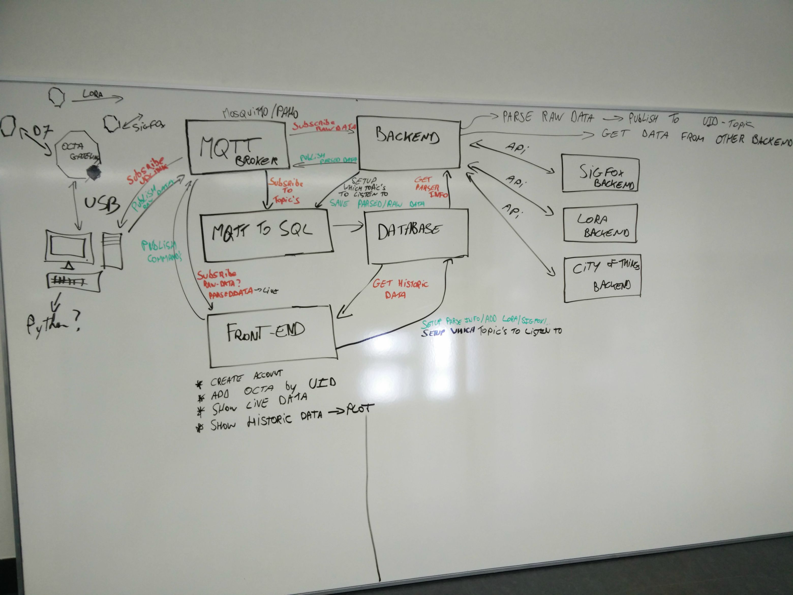

# 4. Technisch

## 4.1 Analyse

Op de eerste dag van de stage werd samengezeten om een gepaste opdracht uit te stippelen aangezien deze nog niet was bepaald. Het enige dat zeker was, was dat de applicatie rond het OCTA Platform zou draaien. Hiervoor bestonden uiteindelijk nog niet veel applicaties, wat wel nodig is voor een product dat commercieel gelanceerd zou worden. Er werd uiteindelijk besloten om een algemene full-stack applicatie te ontwikkelen die de binnenkomende data van elke OCTA-Gateway kon verwerken en visualiseren; een applicatie die door iedereen gebruikt kon worden die het toestel zou aanschaffen. 

### 4.1.1 Oorspronkelijke architectuur
Er werd een architectuur geschetst, die open stond voor verandering: 

<!--De beste manier om te werk te gaan was wel degelijk met web-based technologieen. Een alternatief zou geweest zijn om de gateway in python te schrijven, maar aangezien er betrouwbare oplossingen waren met Node.js modules, werd er voor het laatste gekozen. Ook is het makkelijker om het gehele platform te onderhouden als het in dezelfde taal (JavaScript) geschreven is.-->

*Fig. 2: Oorspronkelijke architectuur* 
 
Hierin werd voorgesteld om de gateway-software in Python te schrijven. Deze gateway-software stuurde de data door naar de MQTT-broker. De MQTT-broker kon een third party service zijn zoals HiveMQ, of een broker die werd gehost op eigen servers, zoals de open-source Mosquitto. De MQTT werd omgezet naar SQL queries om in een database te zetten. Deze SQL werd dan weer opgehaald door de backend, en de front-end zou op zijn beurt alle data weergeven. In de front-end zouden de belangrijkste functies zijn:

* Een account aanmaken
* Een OCTA Connect-gateway toevoegen per UID (OCTA ID)
* Live data laten zien die automatisch dus werd geupdatet
* Historic data tonen aan de hand van charts en figuren
* Toekomstig werk zou dan kunnen zijn: support toevoegen voor het SigFox-netwerk en het LoRa-netwerk (ook het gehele City of Things-netwerk zou bereikt kunnen worden)
 

Na wat opzoek- en analyseerwerk werd het duidelijk dat voor sommige onderdelen er betere alternatieven waren. Een non-relationele database zou ideaal zijn aangezien elke datapoint dan als JSON-object opgeslagen kon worden. Een aparte collectie in de MongoDB database zou authenticatie behandelen en een userbase bevatten.
De backend is uiteindelijk in Node.JS geschreven, en om homogeniteit in het platform te behouden werd ook de gateway-software in JavaScript geschreven, gebruik makend van technologieën die desktop-applicaties kunnen creeeren met het Node.JS framework (Electron e.d.).

Op de uiteindelijke architectuur van het platform zal zo dadelijk dieper worden ingegaan, in het hoofdstuk *Design*.

Het onderdeel dat niet door mij behandeld werd is de hardware. Om een OCTA Connect-gateway te simuleren werd een Gecko development board gebruikt. Deze was echter nog niet klaar dus om dummy data te genereren heb ik een opstelling met een Arduino Uno en een lichtsensor gebruikt, die de data ook serieel doorgeeft na een bepaald tijdsinterval.

## 4.2 Design
Hier een schema van de uiteindelijke architectuur:   
 
*Fig. 3: Architectuur. Rood aangeduid: wat in dit document onbesproken blijft.*

### 4.2.1 Client
#### 4.2.1.1 Desktop applicatie
 *Fig. 4: Beta-versie van de publishing desktop applicatie 
De client side bestaat er een desktop applicatie. Deze cross-platform applicatie behandelt de data die binnenkomt via de OCTA-Connect gateway. Echte OCTA-Gateways zijn nog niet beschikbaar dus werden ze voor dit project gesimuleerd met een Gecko development board. Deze gateway krijgt de data binnen (voornamelijk via het DASH7 Alliance Protocol, door middel van een DASH7 module ontwikkeld door de Universiteit Antwerpen zelf) en stuurt ze onmiddelijk via de UART door in seriële vorm naar de PC van de gebruiker. Op de desktop-applicatie kan gekozen worden door welke COM-poort de gegevens binnenkomen. Ze worden dan gepublisht naar een topic van de MQTT broker die gehost wordt op eigen servers.

De applicatie zelf is geschreven in JavaScript, gebruik makend van het Electron framework. Dit wil zeggen dat het in essentie een Node.js applicatie is die lokaal draait. Het grote voordeel hiervan is dat Node.JS modules gebruikt kunnen worden voor allerlei taken en er dus overbodige code weggelaten kan worden. Om de publisher te maken moest gebruik kunnen worden gemaakt van de USB-poort en de data die hier binnenkwam; hiervoor bestond de *serialport* module. Ook moest er een module gevonden worden voor MQTT. Hiervoor bestond de vanzelfsprekende *mqtt* module. 

Op de modules, en waarom eventuele alternatieven niet gebruikt werden, zal dieper worden ingegaan tijdens het ontwikkelproces.

#### 4.2.1.2 Web-based applicatie

Nadat de gegevens verstuurd zijn naar de backend kan door de gebruiker ook worden ingelogd op het platform dat web-based is. Voor het dashboard werd bootstrap gebruikt; specifieker een bootstrap template genaamd *Admin-LTE*. In deze template werd AngularJS gegoten om het dashboard dynamisch te maken.
Standaard had de template allerlei extra's, zoals notificaties, die niet noodzakelijk zijn en dus verwijderd werden. De vensters en knoppen zitten nog wel in de stylesheet, dus kunnen eventueel later nog geimplementeerd worden. 

Voor de authenticatie was enkel een form nodig die de nodige gegevens naar de backend stuurde. Wanneer ingelogd komt men op het dashboard terecht, waar een overzichtje wacht met alle recentste datapunten. Hieruit wordt ook eerst de OCTA ID gehaald om zeker te zijn dat geen irrelevante data/data van iemand anders wordt getoond. De datapunten worden opgehaald door een http get in de controller van de applicatie. Links is een sidebar met links naar de charts, lists, en account info. In de charts wordt historische data gevisualiseerd aan de hand van grafieken. Hiervoor werd ChartJS gebruikt. In de lists wordt een tabel getoond met alle historische datapunten en timestamps. Bij account info kan je uitloggen of je account verwijderen. Future work hier is extra OCTA-gateways per UID toevoegen, en de parser instellen om persoonlijkere data te verkrijgen.

### 4.2.2 MQTT Broker
De MQTT broker wordt momenteel gehost op een server buiten de UAntwerpen; op naam van Jens Vanhooydonck en op basis van Mosquitto. Deze kan gemakkelijk vervangen worden door een alternatieve server of broker zonder dat de nieuwe server hiervoor geconfigureerd hoeft te worden. Enkel de verwijzingen in de applicatie zelf moeten aangepast worden.

### 4.2.3 Server
De backend, die op Node.js draait, wordt eveneens gehost op eigen servers. Hier draaien verschillende modules op die elk een eigen taak heeft. Op de server wordt gesubscribed op hetzelfde topic van de broker, waardoor de data onmiddelijk binnenkomt in de backend. Ze worden volgens een model rechtstreeks rauw opgeslagen in de database, met samen in het object de timestamp waarop het binnenkomt en de uid van de gateway.
Op de backend wordt de authenticatie behandeld door PassportJS, een npm module, waarover later meer. 
Wanneer op het OCTA-Connect platform wordt ingelogd, geeft de backend door middel van Express routing de datapunten door aan de front-end. 

